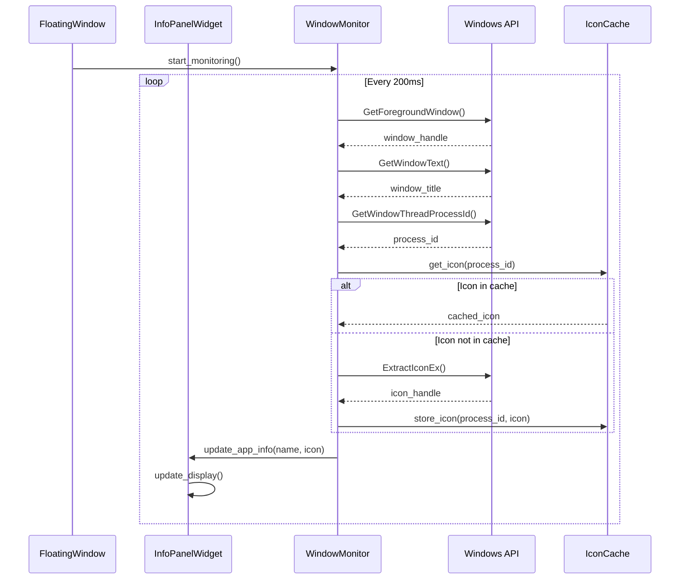

# Design Document: Active App Display

## Overview

Функция Active App Display добавляет информационную панель в нижней части плавающего окна RapidWhisper, которая отображает контекстную информацию о текущем активном приложении и доступных горячих клавишах. Панель состоит из трех основных компонентов:

1. **Window Monitor** - служба для отслеживания активного окна и извлечения информации о приложении
2. **Info Panel Widget** - UI компонент для отображения информации
3. **Hotkey Formatter** - утилита для форматирования горячих клавиш в читаемый вид

Дизайн следует принципам минимального влияния на производительность, асинхронной обработки и кроссплатформенной расширяемости.

## Architecture

### Component Diagram

```mermaid
graph TB
    FW[FloatingWindow] --> IPW[InfoPanelWidget]
    FW --> WM[WindowMonitor]
    WM --> WWM[WindowsWindowMonitor]
    WM --> Cache[IconCache]
    IPW --> HF[HotkeyFormatter]
    IPW --> CM[ConfigManager]
    WWM --> WinAPI[Windows API]
    
    style FW fill:#2d3748
    style IPW fill:#4a5568
    style WM fill:#4a5568
    style WWM fill:#718096
```



### Sequence Diagram: Window Update Flow



## Components and Interfaces

### 1. WindowMonitor (Abstract Base Class)

**Purpose:** Абстрактный интерфейс для мониторинга активного окна на разных платформах.

**Interface:**
```python
from abc import ABC, abstractmethod
from dataclasses import dataclass
from typing import Optional
from PyQt6.QtGui import QPixmap

@dataclass
class WindowInfo:
    """Информация об активном окне"""
    title: str
    process_name: str
    icon: Optional[QPixmap]
    process_id: int

class WindowMonitor(ABC):
    """Абстрактный базовый класс для мониторинга активного окна"""
    
    @abstractmethod
    def get_active_window_info(self) -> Optional[WindowInfo]:
        """
        Получить информацию о текущем активном окне.
        
        Returns:
            WindowInfo если окно найдено, None в случае ошибки
        """
        pass
    
    @abstractmethod
    def start_monitoring(self, callback: callable) -> None:
        """
        Начать мониторинг активного окна.
        
        Args:
            callback: Функция, вызываемая при изменении активного окна
        """
        pass
    
    @abstractmethod
    def stop_monitoring(self) -> None:
        """Остановить мониторинг активного окна"""
        pass
```

### 2. WindowsWindowMonitor

**Purpose:** Конкретная реализация мониторинга для Windows с использованием win32 API.

**Implementation Details:**
```python
import win32gui
import win32process
import win32ui
import win32con
import psutil
from PyQt6.QtCore import QTimer
from PyQt6.QtGui import QPixmap, QImage
from typing import Optional, Dict
import logging

class WindowsWindowMonitor(WindowMonitor):
    """Реализация мониторинга окон для Windows"""
    
    def __init__(self):
        self._timer: Optional[QTimer] = None
        self._callback: Optional[callable] = None
        self._icon_cache: Dict[int, QPixmap] = {}
        self._last_window_handle: Optional[int] = None
        self._cache_max_size = 50
        self._cache_access_count: Dict[int, int] = {}
        self._logger = logging.getLogger(__name__)
    
    def get_active_window_info(self) -> Optional[WindowInfo]:
        """Получить информацию о текущем активном окне через Windows API"""
        try:
            # Получить handle активного окна
            hwnd = win32gui.GetForegroundWindow()
            if not hwnd:
                return None
            
            # Получить заголовок окна
            title = win32gui.GetWindowText(hwnd)
            if not title:
                title = "Unknown Window"
            
            # Получить process ID
            _, process_id = win32process.GetWindowThreadProcessId(hwnd)
            
            # Получить имя процесса
            try:
                process = psutil.Process(process_id)
                process_name = process.name()
            except (psutil.NoSuchProcess, psutil.AccessDenied):
                process_name = "Unknown Process"
            
            # Получить иконку (с кэшированием)
            icon = self._get_window_icon(hwnd, process_id)
            
            return WindowInfo(
                title=title,
                process_name=process_name,
                icon=icon,
                process_id=process_id
            )
        
        except Exception as e:
            self._logger.error(f"Error getting window info: {e}")
            return None
    
    def _get_window_icon(self, hwnd: int, process_id: int) -> Optional[QPixmap]:
        """Получить иконку окна с кэшированием"""
        # Проверить кэш
        if process_id in self._icon_cache:
            self._cache_access_count[process_id] += 1
            return self._icon_cache[process_id]
        
        # Извлечь иконку
        try:
            # Попытка 1: Получить иконку из окна
            icon_handle = win32gui.SendMessage(
                hwnd, win32con.WM_GETICON, win32con.ICON_SMALL, 0
            )
            
            if not icon_handle:
                # Попытка 2: Получить иконку из класса окна
                icon_handle = win32gui.GetClassLong(hwnd, win32con.GCL_HICON)
            
            if icon_handle:
                # Конвертировать HICON в QPixmap
                pixmap = self._hicon_to_qpixmap(icon_handle)
                if pixmap:
                    self._cache_icon(process_id, pixmap)
                    return pixmap
            
            # Попытка 3: Извлечь иконку из исполняемого файла
            try:
                process = psutil.Process(process_id)
                exe_path = process.exe()
                pixmap = self._extract_icon_from_exe(exe_path)
                if pixmap:
                    self._cache_icon(process_id, pixmap)
                    return pixmap
            except (psutil.NoSuchProcess, psutil.AccessDenied):
                pass
        
        except Exception as e:
            self._logger.warning(f"Error extracting icon: {e}")
        
        return None
    
    def _hicon_to_qpixmap(self, icon_handle: int) -> Optional[QPixmap]:
        """Конвертировать Windows HICON в QPixmap"""
        try:
            # Получить информацию об иконке
            icon_info = win32gui.GetIconInfo(icon_handle)
            hdc = win32ui.CreateDCFromHandle(win32gui.GetDC(0))
            hbmp = win32ui.CreateBitmapFromHandle(icon_info[4])
            
            # Получить размеры
            bmp_info = hbmp.GetInfo()
            width, height = bmp_info['bmWidth'], bmp_info['bmHeight']
            
            # Создать совместимый DC и скопировать битмап
            mem_dc = hdc.CreateCompatibleDC()
            mem_dc.SelectObject(hbmp)
            
            # Конвертировать в QImage
            bmp_str = hbmp.GetBitmapBits(True)
            image = QImage(
                bmp_str, width, height, QImage.Format.Format_ARGB32
            )
            
            # Очистка ресурсов
            win32gui.DeleteObject(icon_info[4])
            mem_dc.DeleteDC()
            hdc.DeleteDC()
            
            return QPixmap.fromImage(image)
        
        except Exception as e:
            self._logger.warning(f"Error converting HICON: {e}")
            return None
    
    def _extract_icon_from_exe(self, exe_path: str) -> Optional[QPixmap]:
        """Извлечь иконку из исполняемого файла"""
        try:
            import win32api
            
            # Извлечь иконку
            ico_x = win32api.GetSystemMetrics(win32con.SM_CXICON)
            ico_y = win32api.GetSystemMetrics(win32con.SM_CYICON)
            
            large, small = win32gui.ExtractIconEx(exe_path, 0)
            if small:
                icon_handle = small[0]
                pixmap = self._hicon_to_qpixmap(icon_handle)
                # Очистка
                for icon in small:
                    win32gui.DestroyIcon(icon)
                for icon in large:
                    win32gui.DestroyIcon(icon)
                return pixmap
        
        except Exception as e:
            self._logger.warning(f"Error extracting icon from exe: {e}")
        
        return None
    
    def _cache_icon(self, process_id: int, icon: QPixmap) -> None:
        """Кэшировать иконку с управлением размером кэша"""
        # Проверить размер кэша
        if len(self._icon_cache) >= self._cache_max_size:
            # Удалить наименее используемую иконку
            least_used = min(
                self._cache_access_count.items(), 
                key=lambda x: x[1]
            )[0]
            del self._icon_cache[least_used]
            del self._cache_access_count[least_used]
        
        self._icon_cache[process_id] = icon
        self._cache_access_count[process_id] = 1
    
    def start_monitoring(self, callback: callable) -> None:
        """Начать мониторинг с интервалом 200ms"""
        self._callback = callback
        self._timer = QTimer()
        self._timer.timeout.connect(self._check_active_window)
        self._timer.start(200)  # 200ms интервал
    
    def _check_active_window(self) -> None:
        """Проверить активное окно и вызвать callback при изменении"""
        try:
            hwnd = win32gui.GetForegroundWindow()
            
            # Проверить, изменилось ли окно
            if hwnd != self._last_window_handle:
                self._last_window_handle = hwnd
                window_info = self.get_active_window_info()
                
                if window_info and self._callback:
                    self._callback(window_info)
        
        except Exception as e:
            self._logger.error(f"Error checking active window: {e}")
    
    def stop_monitoring(self) -> None:
        """Остановить мониторинг"""
        if self._timer:
            self._timer.stop()
            self._timer = None
        self._callback = None
```

### 3. HotkeyFormatter

**Purpose:** Утилита для форматирования горячих клавиш в читаемый вид.

**Implementation:**
```python
from typing import List

class HotkeyFormatter:
    """Форматирование горячих клавиш для отображения"""
    
    # Маппинг специальных клавиш на символы
    SPECIAL_KEYS = {
        'space': '⎵Space',
        'enter': '↵Enter',
        'tab': '⇥Tab',
        'backspace': '⌫Backspace',
        'delete': '⌦Delete',
        'esc': 'Esc',
        'escape': 'Esc',
        'up': '↑',
        'down': '↓',
        'left': '←',
        'right': '→',
    }
    
    # Маппинг модификаторов
    MODIFIERS = {
        'ctrl': 'Ctrl',
        'control': 'Ctrl',
        'alt': 'Alt',
        'shift': 'Shift',
        'cmd': 'Cmd',
        'command': 'Cmd',
        'win': 'Win',
        'windows': 'Win',
    }
    
    @staticmethod
    def format_hotkey(hotkey: str) -> str:
        """
        Форматировать горячую клавишу в читаемый вид.
        
        Args:
            hotkey: Строка горячей клавиши (например, "ctrl+space", "f1")
        
        Returns:
            Отформатированная строка (например, "Ctrl+⎵Space", "F1")
        
        Examples:
            >>> HotkeyFormatter.format_hotkey("ctrl+space")
            "Ctrl+⎵Space"
            >>> HotkeyFormatter.format_hotkey("f1")
            "F1"
            >>> HotkeyFormatter.format_hotkey("ctrl+shift+a")
            "Ctrl+Shift+A"
        """
        if not hotkey:
            return ""
        
        # Разделить на части
        parts = hotkey.lower().split('+')
        formatted_parts: List[str] = []
        
        for part in parts:
            part = part.strip()
            
            # Проверить модификаторы
            if part in HotkeyFormatter.MODIFIERS:
                formatted_parts.append(HotkeyFormatter.MODIFIERS[part])
            
            # Проверить специальные клавиши
            elif part in HotkeyFormatter.SPECIAL_KEYS:
                formatted_parts.append(HotkeyFormatter.SPECIAL_KEYS[part])
            
            # Функциональные клавиши (F1-F12)
            elif part.startswith('f') and len(part) <= 3:
                try:
                    num = int(part[1:])
                    if 1 <= num <= 12:
                        formatted_parts.append(f'F{num}')
                    else:
                        formatted_parts.append(part.upper())
                except ValueError:
                    formatted_parts.append(part.upper())
            
            # Обычные клавиши
            else:
                formatted_parts.append(part.upper())
        
        return '+'.join(formatted_parts)
```

### 4. InfoPanelWidget

**Purpose:** UI компонент для отображения информации об активном приложении и горячих клавишах.

**Implementation:**
```python
from PyQt6.QtWidgets import QWidget, QHBoxLayout, QLabel, QFrame
from PyQt6.QtCore import Qt, pyqtSlot
from PyQt6.QtGui import QPixmap, QFont
from typing import Optional

class InfoPanelWidget(QWidget):
    """Панель информации об активном приложении и горячих клавишах"""
    
    def __init__(self, config_manager, parent=None):
        super().__init__(parent)
        self._config = config_manager
        self._default_icon: Optional[QPixmap] = None
        self._setup_ui()
        self._apply_styles()
    
    def _setup_ui(self) -> None:
        """Настроить UI компоненты"""
        # Главный layout
        main_layout = QHBoxLayout(self)
        main_layout.setContentsMargins(8, 6, 8, 6)
        main_layout.setSpacing(0)
        
        # Левая часть: иконка + название приложения
        left_widget = QWidget()
        left_layout = QHBoxLayout(left_widget)
        left_layout.setContentsMargins(0, 0, 0, 0)
        left_layout.setSpacing(4)
        
        self._app_icon_label = QLabel()
        self._app_icon_label.setFixedSize(20, 20)
        self._app_icon_label.setScaledContents(True)
        
        self._app_name_label = QLabel("No active window")
        self._app_name_label.setFont(QFont("Segoe UI", 11))
        
        left_layout.addWidget(self._app_icon_label)
        left_layout.addWidget(self._app_name_label)
        left_layout.addStretch()
        
        # Правая часть: горячие клавиши
        right_widget = QWidget()
        right_layout = QHBoxLayout(right_widget)
        right_layout.setContentsMargins(0, 0, 0, 0)
        right_layout.setSpacing(12)
        
        # Кнопка записи
        self._record_hotkey_label = QLabel()
        self._record_hotkey_label.setFont(QFont("Segoe UI", 11))
        self._update_record_hotkey()
        
        # Кнопка закрытия
        self._close_hotkey_label = QLabel("Close Esc")
        self._close_hotkey_label.setFont(QFont("Segoe UI", 11))
        
        right_layout.addWidget(self._record_hotkey_label)
        right_layout.addWidget(self._close_hotkey_label)
        
        # Добавить в главный layout
        main_layout.addWidget(left_widget, stretch=1)
        main_layout.addWidget(right_widget, stretch=0)
        
        # Установить фиксированную высоту
        self.setFixedHeight(40)
    
    def _apply_styles(self) -> None:
        """Применить стили к компонентам"""
        # Стиль панели
        self.setStyleSheet("""
            InfoPanelWidget {
                background-color: #1a1a1a;
                border-top: 1px solid #333333;
            }
        """)
        
        # Стиль текста приложения
        self._app_name_label.setStyleSheet("color: #E0E0E0;")
        
        # Стиль горячих клавиш
        hotkey_style = "color: #A0A0A0;"
        self._record_hotkey_label.setStyleSheet(hotkey_style)
        self._close_hotkey_label.setStyleSheet(hotkey_style)
    
    def _update_record_hotkey(self) -> None:
        """Обновить отображение горячей клавиши записи"""
        hotkey = self._config.hotkey
        formatted = HotkeyFormatter.format_hotkey(hotkey)
        self._record_hotkey_label.setText(f"Record {formatted}")
    
    @pyqtSlot(object)
    def update_app_info(self, window_info) -> None:
        """
        Обновить информацию об активном приложении.
        
        Args:
            window_info: WindowInfo объект с информацией об окне
        """
        if not window_info:
            self._app_name_label.setText("No active window")
            self._app_icon_label.clear()
            return
        
        # Обновить название (с усечением)
        title = window_info.title
        if len(title) > 30:
            title = title[:27] + "..."
        self._app_name_label.setText(title)
        
        # Обновить иконку
        if window_info.icon:
            # Масштабировать иконку до 20x20
            scaled_icon = window_info.icon.scaled(
                20, 20,
                Qt.AspectRatioMode.KeepAspectRatio,
                Qt.TransformationMode.SmoothTransformation
            )
            self._app_icon_label.setPixmap(scaled_icon)
        else:
            # Использовать иконку по умолчанию
            if self._default_icon:
                self._app_icon_label.setPixmap(self._default_icon)
            else:
                self._app_icon_label.clear()
    
    def update_hotkey_display(self) -> None:
        """Обновить отображение горячей клавиши (вызывается при изменении конфигурации)"""
        self._update_record_hotkey()
    
    def set_default_icon(self, icon: QPixmap) -> None:
        """Установить иконку по умолчанию для неизвестных приложений"""
        self._default_icon = icon
```

## Data Models

### WindowInfo

```python
@dataclass
class WindowInfo:
    """Информация об активном окне"""
    title: str              # Заголовок окна
    process_name: str       # Имя процесса
    icon: Optional[QPixmap] # Иконка приложения (может быть None)
    process_id: int         # ID процесса
```

### IconCacheEntry

```python
@dataclass
class IconCacheEntry:
    """Запись в кэше иконок"""
    icon: QPixmap          # Кэшированная иконка
    access_count: int      # Количество обращений
    timestamp: float       # Время последнего доступа
```

## Correctness Properties

*Свойство корректности (property) — это характеристика или поведение, которое должно выполняться во всех допустимых выполнениях системы. По сути, это формальное утверждение о том, что система должна делать. Свойства служат мостом между человекочитаемыми спецификациями и машинно-проверяемыми гарантиями корректности.*


### Property 1: Усечение длинных названий приложений
*For any* название приложения длиннее 30 символов, отображаемый текст должен быть усечен до 27 символов с добавлением "..." в конце
**Validates: Requirements 1.4**

### Property 2: Обработка ошибок извлечения иконки
*For any* ошибка при извлечении иконки приложения, Window_Monitor должен возвращать None для иконки без прерывания работы
**Validates: Requirements 2.5**

### Property 3: Отображение горячей клавиши из конфигурации
*For any* значение горячей клавиши в Config_Manager, Info_Panel должен отображать кнопку "Record [formatted_hotkey]" с правильно отформатированной клавишей
**Validates: Requirements 3.2**

### Property 4: Своевременное обновление UI
*For any* изменение активного окна или горячей клавиши, соответствующее отображение в Info_Panel должно обновиться в течение 500ms
**Validates: Requirements 1.2, 3.4**

### Property 5: Форматирование модификаторов
*For any* горячая клавиша содержащая модификаторы (ctrl, alt, shift), HotkeyFormatter должен отображать их с заглавной буквы и знаком "+" (например, "Ctrl+", "Alt+", "Shift+")
**Validates: Requirements 4.1, 4.2, 4.3**

### Property 6: Форматирование клавиш в верхний регистр
*For any* горячая клавиша являющаяся функциональной клавишей (f1-f12) или буквой, HotkeyFormatter должен отображать её в верхнем регистре
**Validates: Requirements 4.5, 4.6**

### Property 7: Масштабирование иконок
*For any* иконка приложения, отображаемая в Info_Panel, она должна быть масштабирована до размера 20x20 пикселей
**Validates: Requirements 5.5**

### Property 8: Сохранение размеров WaveformWidget
*For any* состояние FloatingWindow до и после добавления Info_Panel, размер и позиция WaveformWidget должны оставаться неизменными
**Validates: Requirements 7.2**

### Property 9: Логирование ошибок без прерывания работы
*For any* ошибка возникающая в Window_Monitor, она должна быть залогирована через ErrorLogger, но не должна прерывать работу приложения
**Validates: Requirements 7.5**

### Property 10: Частота опроса активного окна
*For any* последовательность проверок активного окна, интервал между проверками должен быть не менее 200ms
**Validates: Requirements 8.1**

### Property 11: Неблокирующее извлечение иконок
*For any* операция извлечения иконки приложения, UI поток должен оставаться отзывчивым (не блокироваться)
**Validates: Requirements 8.2**

### Property 12: Кэширование иконок с управлением размером
*For any* уникальное приложение, его иконка должна кэшироваться при первом извлечении, и при превышении 50 записей в кэше должны удаляться наименее используемые записи
**Validates: Requirements 8.3, 8.4**

### Property 13: Выбор реализации на основе платформы
*For any* платформа определяемая через platform.system(), Window_Monitor должен автоматически выбирать соответствующую реализацию (WindowsWindowMonitor для Windows, заглушку для других)
**Validates: Requirements 9.3, 9.4**

## Error Handling

### Error Categories

1. **Windows API Errors**
   - Недоступность активного окна (GetForegroundWindow возвращает 0)
   - Ошибка получения заголовка окна
   - Ошибка получения process ID
   - **Handling:** Логировать ошибку, возвращать None, продолжать мониторинг

2. **Icon Extraction Errors**
   - Недоступность иконки окна
   - Ошибка конвертации HICON в QPixmap
   - Ошибка извлечения иконки из exe файла
   - **Handling:** Логировать warning, возвращать None, использовать иконку по умолчанию

3. **Process Access Errors**
   - psutil.NoSuchProcess - процесс завершился
   - psutil.AccessDenied - нет прав доступа к процессу
   - **Handling:** Логировать warning, использовать "Unknown Process" как имя

4. **Cache Management Errors**
   - Переполнение памяти при кэшировании
   - **Handling:** Принудительная очистка кэша, логирование

5. **Configuration Errors**
   - Отсутствие горячей клавиши в конфигурации
   - Невалидный формат горячей клавиши
   - **Handling:** Использовать значение по умолчанию, логировать warning

### Error Recovery Strategy

```python
def _safe_get_window_info(self) -> Optional[WindowInfo]:
    """Безопасное получение информации об окне с обработкой ошибок"""
    try:
        return self.get_active_window_info()
    except Exception as e:
        self._logger.error(f"Failed to get window info: {e}", exc_info=True)
        # Не прерываем работу, возвращаем None
        return None
```

### Logging Strategy

- **ERROR level:** Критические ошибки, которые влияют на функциональность
- **WARNING level:** Некритические ошибки (недоступность иконки, процесса)
- **INFO level:** Изменения активного окна, обновления кэша
- **DEBUG level:** Детальная информация о вызовах API, кэшировании

## Testing Strategy

### Dual Testing Approach

Функция active-app-display будет тестироваться с использованием двух комплементарных подходов:

1. **Unit Tests** - для конкретных примеров, edge cases и интеграционных точек
2. **Property-Based Tests** - для универсальных свойств корректности

### Unit Testing Focus

Unit тесты будут сфокусированы на:

- **Конкретные примеры:** Проверка форматирования специальных клавиш (space → "⎵Space")
- **Edge cases:** Обработка недоступных иконок, отсутствующих процессов
- **UI структура:** Проверка наличия и расположения элементов панели
- **Интеграция:** Проверка взаимодействия InfoPanel с FloatingWindow
- **Жизненный цикл:** Запуск/остановка мониторинга при показе/скрытии окна

### Property-Based Testing Configuration

**Library:** `hypothesis` для Python

**Configuration:**
- Минимум 100 итераций на каждый property test
- Каждый тест должен быть помечен комментарием с ссылкой на design property

**Tag Format:**
```python
# Feature: active-app-display, Property 1: Усечение длинных названий приложений
@given(st.text(min_size=31, max_size=100))
def test_app_name_truncation(app_name):
    ...
```

### Property Testing Focus

Property тесты будут проверять:

1. **Property 1:** Усечение названий - генерация случайных строк разной длины
2. **Property 3:** Отображение горячих клавиш - генерация случайных конфигураций
3. **Property 4:** Время отклика - генерация случайных изменений состояния
4. **Property 5:** Форматирование модификаторов - генерация комбинаций модификаторов
5. **Property 6:** Форматирование клавиш - генерация букв и функциональных клавиш
6. **Property 7:** Масштабирование иконок - генерация иконок разных размеров
7. **Property 10:** Частота опроса - измерение интервалов между проверками
8. **Property 12:** Кэширование - генерация последовательностей запросов иконок

### Test Data Generators

```python
from hypothesis import strategies as st

# Генератор названий приложений
app_names = st.text(min_size=1, max_size=100, alphabet=st.characters(blacklist_categories=('Cs',)))

# Генератор горячих клавиш
modifiers = st.sampled_from(['ctrl', 'alt', 'shift', ''])
keys = st.sampled_from(['a', 'b', 'space', 'f1', 'f12', 'enter'])
hotkeys = st.builds(
    lambda m, k: f"{m}+{k}" if m else k,
    modifiers, keys
)

# Генератор размеров иконок
icon_sizes = st.tuples(
    st.integers(min_value=8, max_value=256),
    st.integers(min_value=8, max_value=256)
)
```

### Mock Strategy

Для тестирования Windows API будут использоваться моки:

```python
from unittest.mock import Mock, patch

@patch('win32gui.GetForegroundWindow')
@patch('win32gui.GetWindowText')
@patch('win32process.GetWindowThreadProcessId')
def test_window_monitor(mock_process, mock_text, mock_window):
    mock_window.return_value = 12345
    mock_text.return_value = "Test Window"
    mock_process.return_value = (0, 9999)
    
    monitor = WindowsWindowMonitor()
    info = monitor.get_active_window_info()
    
    assert info.title == "Test Window"
    assert info.process_id == 9999
```

### Integration Testing

Интеграционные тесты будут проверять:

1. **Полный поток:** FloatingWindow → WindowMonitor → InfoPanel
2. **Обновление конфигурации:** Изменение hotkey → обновление UI
3. **Жизненный цикл:** Показ окна → запуск мониторинга → скрытие окна → остановка мониторинга
4. **Обработка ошибок:** Симуляция ошибок API → проверка логирования → продолжение работы

### Performance Testing

Хотя property-based тесты не фокусируются на производительности, будут добавлены специфические тесты для:

1. **Частота опроса:** Проверка, что интервал между проверками >= 200ms
2. **Размер кэша:** Проверка, что кэш не превышает 50 записей
3. **Время отклика UI:** Проверка, что обновления происходят в течение 500ms

### Test Coverage Goals

- **Общее покрытие кода:** 85%+
- **Критические компоненты (WindowMonitor, InfoPanel):** 95%+
- **Утилиты (HotkeyFormatter):** 100%

## Implementation Notes

### Platform-Specific Considerations

**Windows:**
- Использовать `pywin32` для доступа к Windows API
- Обрабатывать UAC-защищенные окна (могут быть недоступны)
- Учитывать DPI scaling при извлечении иконок

**Future macOS Support:**
- Использовать `AppKit` и `Quartz` для доступа к активному окну
- Использовать `NSWorkspace` для получения информации о приложении

**Future Linux Support:**
- Использовать X11 или Wayland API в зависимости от сессии
- Использовать `xdotool` или `wmctrl` для получения активного окна

### Performance Optimizations

1. **Icon Caching:** LRU кэш с максимум 50 записями
2. **Lazy Loading:** Иконки загружаются асинхронно
3. **Debouncing:** Обновления UI не чаще 200ms
4. **Memory Management:** Автоматическая очистка кэша при превышении лимита

### Dependencies

**New Dependencies:**
```toml
[project.dependencies]
pywin32 = ">=306"  # Windows API access
psutil = ">=5.9.0"  # Process information
```

**Existing Dependencies:**
- PyQt6 (уже используется)
- python-dotenv (уже используется для Config)

### Integration Points

1. **FloatingWindow:** Добавить InfoPanelWidget в layout
2. **ConfigManager:** Подписаться на изменения hotkey
3. **ErrorLogger:** Использовать для логирования ошибок
4. **StateManager:** Запускать/останавливать мониторинг при переходах состояний

### File Structure

```
services/
  window_monitor.py          # Абстрактный базовый класс
  windows_window_monitor.py  # Windows реализация
  
ui/
  info_panel_widget.py       # UI компонент панели
  
utils/
  hotkey_formatter.py        # Утилита форматирования
  
tests/
  test_window_monitor.py     # Unit тесты для мониторинга
  test_info_panel.py         # Unit тесты для UI
  test_hotkey_formatter.py   # Unit и property тесты для форматирования
  test_integration.py        # Интеграционные тесты
```

## Future Enhancements

1. **Кастомизация:** Позволить пользователю настраивать цвета и размеры панели
2. **История:** Показывать последние N активных приложений
3. **Фильтрация:** Игнорировать определенные приложения (например, системные)
4. **Статистика:** Отслеживать время использования каждого приложения
5. **macOS/Linux Support:** Реализовать мониторинг для других платформ
