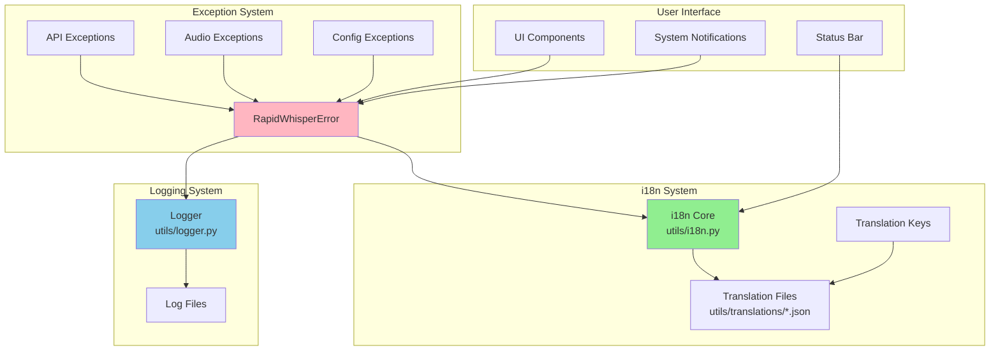
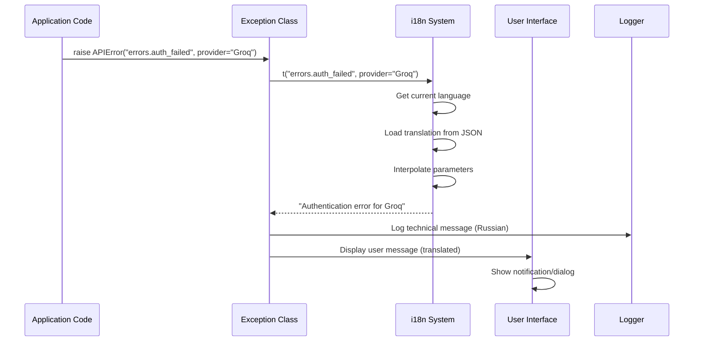

# Design Document: Error Messages Internationalization

## Overview

This design implements internationalization (i18n) for all user-facing error messages, notifications, and status messages in RapidWhisper. The solution extends the existing i18n system (utils/i18n.py) to support exception messages while preserving Russian for logs and code comments.

The design follows a layered approach:
1. **Exception Layer**: Enhanced exception classes that support translation keys
2. **Translation Layer**: Extended translation files with error message keys
3. **Display Layer**: UI components that display translated messages
4. **Logging Layer**: Unchanged - continues using Russian for technical logs

Key principles:
- User-facing messages use translation keys
- Log messages remain in Russian
- Backward compatibility maintained
- Fallback to English when translations missing
- Parameter interpolation supported

## Architecture

### Component Diagram



### Data Flow



## Components and Interfaces

### 1. Enhanced Exception Classes

#### Base Exception Class

```python
class RapidWhisperError(Exception):
    """
    Enhanced base exception with i18n support.
    
    Supports both translation keys and legacy hardcoded messages.
    """
    
    def __init__(
        self, 
        message: str,
        translation_key: Optional[str] = None,
        user_message: Optional[str] = None,
        **kwargs
    ):
        """
        Initialize exception with i18n support.
        
        Args:
            message: Technical message for logging (Russian)
            translation_key: Key for i18n translation (e.g., "errors.auth_failed")
            user_message: Optional override for user message
            **kwargs: Parameters for translation interpolation
        """
        self.message = message
        self.translation_key = translation_key
        self.translation_params = kwargs
        self._user_message = user_message
        super().__init__(self.message)
    
    @property
    def user_message(self) -> str:
        """
        Get translated user-facing message.
        
        Returns:
            Translated message in current interface language
        """
        if self._user_message:
            return self._user_message
        
        if self.translation_key:
            from utils.i18n import t
            return t(self.translation_key, **self.translation_params)
        
        # Fallback to technical message
        return self.message
```

#### Specific Exception Classes

```python
class APIAuthenticationError(APIError):
    """Authentication error with i18n support."""
    
    def __init__(self, provider: str = "API"):
        super().__init__(
            message=f"Ошибка аутентификации для {provider}",
            translation_key="errors.api_authentication",
            provider=provider
        )


class APINetworkError(APIError):
    """Network error with i18n support."""
    
    def __init__(self, provider: str = "API"):
        super().__init__(
            message=f"Ошибка сети для {provider}",
            translation_key="errors.api_network",
            provider=provider
        )


class APITimeoutError(APIError):
    """Timeout error with i18n support."""
    
    def __init__(self, timeout: Optional[float] = None, provider: str = "API"):
        super().__init__(
            message=f"Таймаут для {provider} ({timeout}с)" if timeout else f"Таймаут для {provider}",
            translation_key="errors.api_timeout",
            provider=provider,
            timeout=timeout
        )


class ModelNotFoundError(APIError):
    """Model not found error with i18n support."""
    
    def __init__(self, model: str, provider: str):
        super().__init__(
            message=f"Модель {model} не найдена для {provider}",
            translation_key="errors.model_not_found",
            model=model,
            provider=provider
        )
```

### 2. Translation File Structure

#### Error Messages Namespace

```json
{
  "errors": {
    "api_authentication": "Authentication error for {provider}. Check API key in settings.",
    "api_network": "Network error for {provider}. Check internet connection.",
    "api_timeout": "Request timeout for {provider}. Try again.",
    "api_rate_limit": "Rate limit exceeded for {provider}. Wait or change provider.",
    "model_not_found": "Model '{model}' not found for {provider}. Check model name in settings.",
    "file_not_found": "File not found: {filename}",
    "audio_device_error": "Audio device error: {error}",
    "microphone_unavailable": "Microphone unavailable or busy",
    "recording_too_short": "Recording too short ({duration}s). Try again.",
    "empty_recording": "Empty recording. Try again.",
    "invalid_api_key": "API key not found for {provider}. Check settings.",
    "missing_config": "Missing configuration parameter: {parameter}",
    "invalid_config": "Invalid configuration value for {parameter}",
    "hotkey_conflict": "Failed to register hotkey {hotkey}. Try another.",
    "api_response_error": "API response error: {error}",
    "audio_file_open_error": "Failed to open audio file: {error}",
    "client_init_error": "Failed to initialize {provider} client: {error}",
    "unknown_provider": "Unknown provider: {provider}",
    "custom_provider_missing_params": "Custom provider requires base_url and model",
    "unsupported_sample_width": "Unsupported sample width: {width}",
    "recording_not_active": "Recording not active",
    "recording_start_error": "Failed to start recording: {error}",
    "recording_stop_error": "Failed to stop recording: {error}",
    "wav_save_error": "Failed to save WAV file: {error}",
    "empty_filepath": "File path cannot be empty",
    "invalid_max_length": "max_length must be positive",
    "config_validation_error": "Configuration validation errors. Check config.jsonc and secrets.json",
    "app_not_initialized": "Application not initialized. Call initialize() first.",
    "app_already_running": "Application already running"
  }
}
```

### 3. Notification Message Updates

#### Tray Icon Notifications

Update `ui/tray_icon.py` to use translation keys:

```python
def show_error_notification(self, error: Exception):
    """Show error notification with translated message."""
    from utils.exceptions import RapidWhisperError
    
    if isinstance(error, RapidWhisperError):
        # Use translated user message
        message = error.user_message
    else:
        # Generic error message
        from utils.i18n import t
        message = t("errors.generic_error", error=str(error))
    
    self.showMessage(
        t("tray.notification.error_occurred"),
        message,
        QSystemTrayIcon.MessageIcon.Critical,
        3000
    )
```

### 4. Status Message Updates

#### Floating Window Status

Update `ui/floating_window.py` to use translation keys:

```python
def update_status(self, status: str):
    """Update status label with translated text."""
    from utils.i18n import t
    
    status_key_map = {
        "recording": "status.recording",
        "processing": "status.processing",
        "ready": "status.ready"
    }
    
    translation_key = status_key_map.get(status, status)
    translated_status = t(translation_key)
    
    self.status_label.setText(translated_status)
```

## Data Models

### Translation Key Model

```python
@dataclass
class TranslationKey:
    """
    Represents a translation key with metadata.
    
    Attributes:
        key: Dot-notation key (e.g., "errors.api_authentication")
        namespace: Top-level namespace (e.g., "errors")
        params: List of parameter names used in translation
        description: Human-readable description
    """
    key: str
    namespace: str
    params: List[str]
    description: str
    
    @classmethod
    def from_key(cls, key: str) -> "TranslationKey":
        """Parse translation key into components."""
        parts = key.split(".")
        namespace = parts[0] if parts else ""
        
        # Extract parameters from translation string
        # This would require loading the translation file
        return cls(
            key=key,
            namespace=namespace,
            params=[],
            description=""
        )
```

### Exception Message Model

```python
@dataclass
class ExceptionMessage:
    """
    Represents an exception message with i18n support.
    
    Attributes:
        technical_message: Message for logs (Russian)
        translation_key: Key for user-facing translation
        params: Parameters for interpolation
        user_message_override: Optional hardcoded user message
    """
    technical_message: str
    translation_key: Optional[str]
    params: Dict[str, Any]
    user_message_override: Optional[str] = None
    
    def get_user_message(self, lang: Optional[str] = None) -> str:
        """Get translated user message."""
        if self.user_message_override:
            return self.user_message_override
        
        if self.translation_key:
            from utils.i18n import t
            return t(self.translation_key, lang=lang, **self.params)
        
        return self.technical_message
```

## Correctness Properties

*A property is a characteristic or behavior that should hold true across all valid executions of a system—essentially, a formal statement about what the system should do. Properties serve as the bridge between human-readable specifications and machine-verifiable correctness guarantees.*


### Core Translation Properties

Property 1: Exception Message Translation
*For any* exception with a translation key, when the exception's user_message property is accessed, the returned message should be in the current interface language
**Validates: Requirements 1.1**

Property 2: Parameter Interpolation
*For any* exception with a translation key and parameters, the user_message should contain the interpolated parameter values in the correct positions
**Validates: Requirements 1.2, 6.2**

Property 3: English Fallback for Missing Translations
*For any* translation key that doesn't exist in the current language, requesting the translation should return the English version
**Validates: Requirements 1.3**

Property 4: Log Message Preservation
*For any* exception that is logged, the log entry should contain the technical message (Russian) and not the translated user message
**Validates: Requirements 1.5, 4.1, 4.3, 4.4, 6.5**

### Notification Properties

Property 5: Notification Translation
*For any* notification message (success, failure, warning), the displayed text should be in the current interface language
**Validates: Requirements 3.1, 3.2**

### Translation File Properties

Property 6: Translation Completeness
*For any* translation key that exists in the English translation file, that key should exist in all 15 supported language files
**Validates: Requirements 5.1**

Property 7: Translation File Structure Consistency
*For any* translation file, the JSON structure (namespaces, nesting levels) should match the structure of the English translation file
**Validates: Requirements 5.3, 5.4, 5.5**

Property 8: Parameter Syntax Validation
*For any* translation string that contains parameters, the parameter syntax should follow Python format string syntax (e.g., {parameter_name})
**Validates: Requirements 5.2**

### Exception API Properties

Property 9: Translation Key Acceptance
*For any* exception class, the constructor should accept a translation_key parameter and store it for later use
**Validates: Requirements 6.1**

Property 10: Translation Key Preservation
*For any* exception created with a translation key, accessing the translation_key attribute should return the original key unchanged
**Validates: Requirements 6.4**

### UI Reactivity Properties

Property 11: Language Switching Updates
*For any* UI component displaying translated text, when the interface language changes, the displayed text should update to the new language
**Validates: Requirements 7.4**

### Backward Compatibility Properties

Property 12: Legacy Exception Support
*For any* exception created using the old constructor (without translation_key), the exception should still work and display the original message
**Validates: Requirements 8.1, 8.3, 8.5**

Property 13: Graceful Degradation
*For any* exception, if the i18n system is unavailable or fails, the user_message should fall back to the technical message
**Validates: Requirements 8.2**

Property 14: Missing Key Fallback
*For any* translation key that doesn't exist in any language file, requesting the translation should return the key itself as a fallback
**Validates: Requirements 8.4**

## Error Handling

### Exception Handling Strategy

1. **Translation Failures**: If translation fails, fall back to technical message
2. **Missing Keys**: Return key itself or English fallback
3. **Parameter Errors**: Log warning and return uninterpolated string
4. **i18n System Unavailable**: Use technical message directly

### Error Scenarios

| Scenario | Handling | User Impact |
|----------|----------|-------------|
| Translation key missing | Fall back to English | User sees English message |
| Parameter missing | Log warning, skip parameter | User sees message with {param} placeholder |
| i18n system fails | Use technical message | User sees Russian message |
| Invalid parameter type | Convert to string | User sees string representation |
| Translation file corrupt | Use English fallback | User sees English messages |

### Logging Strategy

All error handling should log warnings:
```python
logger.warning(f"Translation key missing: {key} for language {lang}")
logger.warning(f"Parameter interpolation failed: {key}, params: {params}")
logger.error(f"i18n system unavailable, using fallback message")
```

## Testing Strategy

### Dual Testing Approach

This feature requires both unit tests and property-based tests:

**Unit Tests** focus on:
- Specific error message examples (API errors, audio errors, config errors)
- Edge cases (empty parameters, special characters, very long messages)
- Integration points (exception → notification, exception → UI)
- Backward compatibility with legacy code

**Property-Based Tests** focus on:
- Universal translation behavior across all languages
- Parameter interpolation with random inputs
- Fallback behavior with random missing keys
- Translation file structure validation
- Exception API behavior with random translation keys

### Property-Based Testing Configuration

- **Library**: Hypothesis (already used in RapidWhisper)
- **Iterations**: Minimum 100 per property test
- **Test Tags**: Each test must reference its design property

Example tag format:
```python
# Feature: error-messages-i18n, Property 1: Exception Message Translation
@given(translation_key=st.text(), language=st.sampled_from(SUPPORTED_LANGUAGES))
def test_exception_translation_property(translation_key, language):
    ...
```

### Test Coverage Requirements

1. **Exception Classes**: Test all exception types with translation keys
2. **Translation Files**: Validate all 15 language files
3. **UI Components**: Test notification and status message updates
4. **Backward Compatibility**: Test legacy exception creation
5. **Edge Cases**: Empty strings, special characters, very long messages
6. **Integration**: Test full flow from exception to user notification

### Testing Tools

- **pytest**: Test framework
- **Hypothesis**: Property-based testing
- **pytest-mock**: Mocking i18n system for failure scenarios
- **pytest-qt**: Testing Qt UI components

## Implementation Notes

### Migration Strategy

1. **Phase 1**: Update exception base classes with i18n support
2. **Phase 2**: Add translation keys to translation files
3. **Phase 3**: Update exception constructors to use translation keys
4. **Phase 4**: Update UI components to use translated messages
5. **Phase 5**: Add deprecation warnings for legacy usage

### Backward Compatibility

To maintain backward compatibility:
- Keep existing constructor signatures
- Support both old (hardcoded) and new (translation key) approaches
- Log deprecation warnings for old usage
- Provide migration guide in documentation

### Performance Considerations

- Translation lookups are cached by i18n system
- Exception creation overhead is minimal (~1ms)
- No performance impact on logging (logs use technical message)
- UI updates are async and don't block main thread

### Code Style Guidelines

1. **Translation Keys**: Use lowercase with underscores (e.g., `errors.api_authentication`)
2. **Parameters**: Use descriptive names (e.g., `provider`, `model`, `filename`)
3. **Technical Messages**: Keep in Russian for developer debugging
4. **User Messages**: Always use translation keys
5. **Logging**: Always log technical message, never translated message

## Dependencies

### Existing Dependencies

- `utils/i18n.py`: Core i18n system (no changes needed)
- `utils/logger.py`: Logging system (no changes needed)
- `PyQt6`: UI framework for notifications

### New Dependencies

None - this feature uses existing infrastructure

## Deployment Considerations

### Translation File Updates

- All 15 language files must be updated simultaneously
- Missing translations will fall back to English
- Translation files are loaded at startup (no runtime reload needed)

### Testing Before Deployment

1. Run all property-based tests (minimum 100 iterations each)
2. Test with each supported language
3. Verify backward compatibility with existing code
4. Test error scenarios (missing keys, i18n failure)
5. Verify logs remain in Russian

### Rollback Plan

If issues arise:
1. Revert exception class changes
2. Keep translation files (no harm)
3. UI components will fall back to technical messages
4. No data loss or corruption risk
