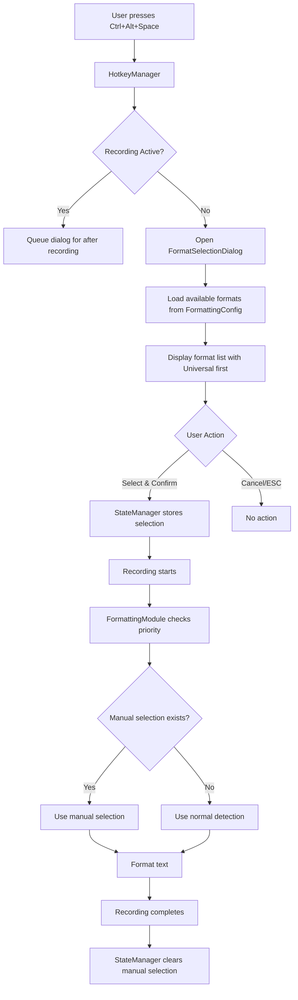
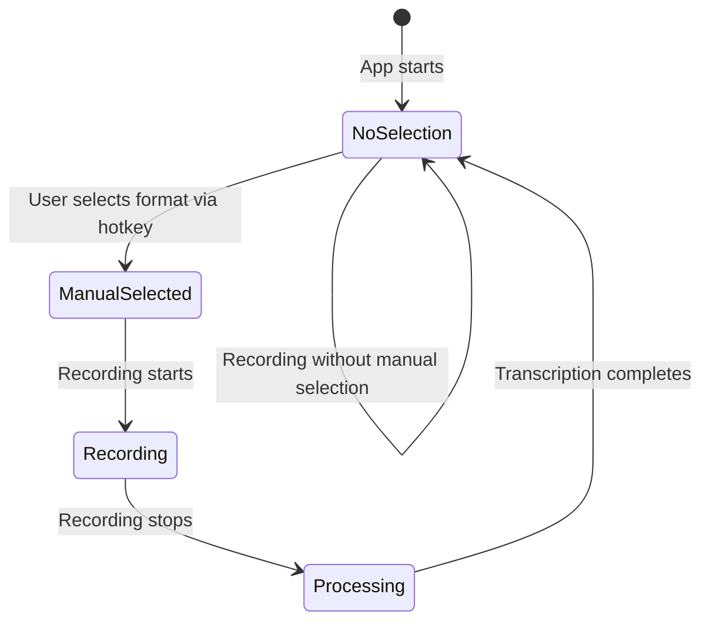

# Design Document: Manual Format Selection Hotkey

## Overview

This feature adds a manual format selection capability to RapidWhisper, allowing users to explicitly choose a formatting application for the current recording session via a hotkey-triggered dialog. The manual selection overrides all automatic format determination methods (fixed format setting and application detection) and applies only to the current session.

The feature integrates with the existing formatting system, hotkey management, and state management components. It introduces a new dialog component and extends the state manager to track session-scoped manual selections.

## Architecture

### Component Interaction



### Priority System

The format determination follows this strict priority order:

1. **Manual_Format_Selection** (highest priority) - Set via Ctrl+Alt+Space dialog
2. **Fixed_Format_Setting** - use_fixed_format configuration option
3. **Automatic Application Detection** - Window title/process name matching
4. **Universal_Format** (fallback) - Default formatting

### Session Lifecycle



## Components and Interfaces

### 1. FormatSelectionDialog (New Component)

**Location:** `ui/format_selection_dialog.py`

**Purpose:** Modal dialog for selecting formatting application

**Class Definition:**
```python
class FormatSelectionDialog(QDialog):
    """
    Modal dialog for manual format selection.
    
    Displays a list of available formatting applications and allows
    the user to select one for the current recording session.
    """
    
    def __init__(self, formatting_config: FormattingConfig, parent=None):
        """
        Initialize the format selection dialog.
        
        Args:
            formatting_config: Configuration containing available formats
            parent: Parent widget
        """
        
    def get_selected_format(self) -> Optional[str]:
        """
        Get the user's selected format.
        
        Returns:
            Format identifier (e.g., "notion", "markdown", "_fallback")
            or None if dialog was cancelled
        """
        
    def _load_formats(self) -> List[Tuple[str, str]]:
        """
        Load available formats from configuration.
        
        Returns:
            List of (format_id, display_name) tuples
            Universal format is always first
        """
        
    def _create_ui(self):
        """Create the dialog UI with format list and buttons."""
        
    def _on_format_selected(self, index: int):
        """Handle format selection from list."""
        
    def _on_confirm(self):
        """Handle confirmation button click."""
        
    def _on_cancel(self):
        """Handle cancel button click or ESC key."""
```

**UI Layout:**
- Title: "Select Format" (localized)
- List widget showing available formats
- Universal/_fallback format always appears first
- Keyboard navigation: Arrow keys, Enter to confirm, ESC to cancel
- Buttons: "OK" and "Cancel"
- Modal dialog (blocks interaction with other windows)
- Positioned near cursor or center of screen

### 2. StateManager (Extended)

**Location:** `core/state_manager.py`

**New Attributes:**
```python
class StateManager(QObject):
    # Existing attributes...
    
    # New attribute for manual format selection
    _manual_format_selection: Optional[str] = None
    _current_session_id: Optional[str] = None
```

**New Methods:**
```python
def set_manual_format_selection(self, format_id: str) -> None:
    """
    Store manual format selection for current session.
    
    Args:
        format_id: Format identifier (e.g., "notion", "_fallback")
    """
    
def get_manual_format_selection(self) -> Optional[str]:
    """
    Get manual format selection for current session.
    
    Returns:
        Format identifier or None if not set
    """
    
def clear_manual_format_selection(self) -> None:
    """
    Clear manual format selection.
    
    Called when recording session completes.
    """
    
def start_recording_session(self) -> None:
    """
    Start a new recording session.
    
    Generates a new session ID and clears any previous manual selection.
    """
    
def end_recording_session(self) -> None:
    """
    End the current recording session.
    
    Clears manual format selection and session ID.
    """
```

### 3. FormattingModule (Extended)

**Location:** `services/formatting_module.py`

**Modified Method:**
```python
def get_active_application_format(self) -> Optional[str]:
    """
    Detect active application and match against configured formats.
    
    PRIORITY ORDER (highest to lowest):
    1. Manual format selection (from StateManager)
    2. Fixed format setting (use_fixed_format)
    3. Automatic application detection
    4. Fallback/universal format
    
    Returns:
        Format identifier or None if no match
    """
    # NEW: Check manual selection first
    manual_selection = self.state_manager.get_manual_format_selection()
    if manual_selection:
        logger.info(f"  🎯 Using manual format selection: {manual_selection}")
        return manual_selection
    
    # Existing logic for fixed format and auto-detection...
```

**New Dependency:**
```python
def __init__(self, config_manager=None, ai_client_factory=None, 
             window_monitor=None, state_manager=None):
    """
    Initialize the formatting module.
    
    Args:
        config_manager: Configuration manager
        ai_client_factory: Factory for AI clients
        window_monitor: Window monitoring component
        state_manager: State manager for manual selection (NEW)
    """
    self.state_manager = state_manager
```

### 4. HotkeyManager (Extended)

**Location:** `services/hotkey_manager.py`

**New Method:**
```python
def register_format_selection_hotkey(self, key: str, callback: Callable) -> bool:
    """
    Register the format selection hotkey.
    
    Args:
        key: Hotkey combination (e.g., "ctrl+alt+space")
        callback: Function to call when hotkey is pressed
        
    Returns:
        True if registration successful, False otherwise
    """
```

**Usage:**
The hotkey manager will register a second hotkey (in addition to the main recording hotkey) for format selection. This uses the existing `register_hotkey` method with a callback parameter.

### 5. SettingsWindow (Extended)

**Location:** `ui/settings_window.py`

**Modified Method:**
```python
def _create_app_page(self) -> QWidget:
    """
    Create application settings page.
    
    MODIFIED: Add format selection hotkey configuration
    """
    # Existing hotkey configuration...
    
    # NEW: Format selection hotkey
    format_hotkey_container = QHBoxLayout()
    self.format_hotkey_edit = HotkeyInput()
    self.format_hotkey_edit.setPlaceholderText("ctrl+alt+space")
    format_hotkey_container.addWidget(self.format_hotkey_edit)
    
    reset_format_hotkey_btn = QPushButton("🔄")
    reset_format_hotkey_btn.clicked.connect(self._reset_format_hotkey)
    format_hotkey_container.addWidget(reset_format_hotkey_btn)
    
    format_hotkey_label = QLabel(t("settings.app.format_hotkey"))
    format_hotkey_label.setToolTip(t("settings.app.format_hotkey_tooltip"))
    hotkey_layout.addRow(format_hotkey_label, format_hotkey_container)
```

**New Configuration Field:**
- `application.format_selection_hotkey` in config.jsonc
- Default value: "ctrl+alt+space"
- Stored alongside existing `application.hotkey`

### 6. Main Application (Modified)

**Location:** `main.py`

**Initialization Changes:**
```python
# Initialize state manager
self.state_manager = StateManager()

# Pass state_manager to FormattingModule
self.formatting_module = FormattingModule(
    config_manager=self.config,
    window_monitor=self.window_monitor,
    state_manager=self.state_manager  # NEW
)

# Register format selection hotkey
format_hotkey = self.config.format_selection_hotkey or "ctrl+alt+space"
self.hotkey_manager.register_format_selection_hotkey(
    format_hotkey,
    self._on_format_selection_hotkey
)
```

**New Callback:**
```python
def _on_format_selection_hotkey(self):
    """
    Handle format selection hotkey press.
    
    Opens the format selection dialog unless recording is active.
    If recording is active, queues the dialog to open after recording stops.
    """
    if self.state_manager.get_current_state() == AppState.RECORDING:
        logger.info("Format selection hotkey pressed during recording - queuing")
        self._queue_format_dialog = True
        return
    
    self._show_format_selection_dialog()

def _show_format_selection_dialog(self):
    """Show the format selection dialog and handle the result."""
    dialog = FormatSelectionDialog(self.formatting_module.config, parent=None)
    result = dialog.exec()
    
    if result == QDialog.DialogCode.Accepted:
        selected_format = dialog.get_selected_format()
        if selected_format:
            self.state_manager.set_manual_format_selection(selected_format)
            logger.info(f"Manual format selected: {selected_format}")
            
            # Start recording automatically after selection
            self._on_hotkey_pressed()
```

**Session Lifecycle Integration:**
```python
def _on_transcription_complete(self, text: str):
    """
    Handle transcription completion.
    
    MODIFIED: Clear manual format selection after session completes.
    """
    # Existing transcription logic...
    
    # NEW: Clear manual selection for next session
    self.state_manager.end_recording_session()
```

## Data Models

### Configuration Schema

**config.jsonc additions:**
```jsonc
{
  "application": {
    "hotkey": "F1",
    "format_selection_hotkey": "ctrl+alt+space"  // NEW
  }
}
```

### State Manager Data

**Session State:**
```python
@dataclass
class SessionState:
    """State for a single recording session."""
    session_id: str
    manual_format_selection: Optional[str] = None
    start_time: float = 0.0
    end_time: Optional[float] = None
```

The StateManager maintains this state internally and provides accessor methods.

## Correctness Properties

*A property is a characteristic or behavior that should hold true across all valid executions of a system—essentially, a formal statement about what the system should do. Properties serve as the bridge between human-readable specifications and machine-verifiable correctness guarantees.*

### Property 1: Hotkey triggers dialog opening
*For any* registered format selection hotkey, when pressed outside of recording state, the Format_Selection_Dialog should open and display available formats.
**Validates: Requirements 1.2, 2.1**

### Property 2: Manual selection has highest priority
*For any* recording session where Manual_Format_Selection is set, the Formatting_Module should use the manual selection regardless of Fixed_Format_Setting or automatic application detection.
**Validates: Requirements 4.1, 4.2, 4.3**

### Property 3: Format list includes universal format first
*For any* configuration state, when the Format_Selection_Dialog loads formats, the Universal_Format should always be present and appear as the first item in the list.
**Validates: Requirements 2.2, 6.3**

### Property 4: Selection is session-scoped
*For any* manual format selection, when a Recording_Session completes transcription, the State_Manager should clear the Manual_Format_Selection so it does not affect subsequent sessions.
**Validates: Requirements 4.4, 8.1, 8.2, 8.3**

### Property 5: Keyboard navigation works correctly
*For any* open Format_Selection_Dialog, arrow key presses should navigate through the format list, and Enter should confirm the currently highlighted selection.
**Validates: Requirements 7.1, 7.2**

### Property 6: Format discovery from configuration
*For any* valid configuration with prompt files in config/prompts/, the Format_Selection_Dialog should discover and display all configured formatting applications.
**Validates: Requirements 6.1, 6.2**

### Property 7: Hotkey binding validation
*For any* hotkey binding modification in settings, the System should validate the new binding and either register it (if valid) or display an error and maintain the previous binding (if invalid).
**Validates: Requirements 5.3, 5.4, 5.5**

### Property 8: Translation system usage
*For any* UI text in the Format_Selection_Dialog and settings, the System should use the translation system with appropriate fallback to English when translations are missing.
**Validates: Requirements 9.1, 9.2, 9.3, 9.4**

### Property 9: Normal behavior after cancellation
*For any* Format_Selection_Dialog cancellation (via Cancel button or ESC key), the System should not store any manual selection and should proceed with normal format detection.
**Validates: Requirements 3.3**

### Property 10: Confirmed selection is stored and used
*For any* format selection confirmed in the dialog, the State_Manager should store it and the Formatting_Module should use it for the current Recording_Session.
**Validates: Requirements 3.1, 3.2, 3.4**

## Error Handling

### 1. Hotkey Registration Failure
**Scenario:** Format selection hotkey conflicts with system hotkeys or fails to register

**Handling:**
- Log error with details
- Fall back to default binding (ctrl+alt+space)
- If default also fails, log warning and continue without format selection hotkey
- Display notification to user about hotkey conflict

**Code:**
```python
try:
    success = self.hotkey_manager.register_format_selection_hotkey(
        format_hotkey, callback
    )
    if not success:
        logger.warning(f"Failed to register format hotkey: {format_hotkey}")
        # Try default
        self.hotkey_manager.register_format_selection_hotkey(
            "ctrl+alt+space", callback
        )
except Exception as e:
    logger.error(f"Hotkey registration error: {e}")
    # Continue without format selection hotkey
```

### 2. Format List Loading Failure
**Scenario:** Unable to load formats from configuration

**Handling:**
- Display error message in dialog
- Show only Universal format as fallback
- Log error details
- Allow user to cancel or select Universal format

**Code:**
```python
def _load_formats(self) -> List[Tuple[str, str]]:
    try:
        formats = self._get_formats_from_config()
        if not formats:
            logger.warning("No formats found, using Universal only")
            return [("_fallback", "Universal")]
        return formats
    except Exception as e:
        logger.error(f"Failed to load formats: {e}")
        QMessageBox.warning(
            self,
            "Error",
            "Failed to load format list. Only Universal format available."
        )
        return [("_fallback", "Universal")]
```

### 3. State Manager Storage Failure
**Scenario:** Unable to store manual format selection

**Handling:**
- Log error
- Proceed with normal format detection
- Do not block recording
- Notify user that manual selection could not be applied

**Code:**
```python
def set_manual_format_selection(self, format_id: str) -> None:
    try:
        self._manual_format_selection = format_id
        self._current_session_id = str(uuid.uuid4())
        logger.info(f"Manual format set: {format_id}")
    except Exception as e:
        logger.error(f"Failed to store manual selection: {e}")
        self._manual_format_selection = None
        # Continue with normal detection
```

### 4. Dialog Display Failure
**Scenario:** Format selection dialog fails to open or crashes

**Handling:**
- Catch exception in main callback
- Log error with traceback
- Continue normal operation
- Do not block recording functionality

**Code:**
```python
def _on_format_selection_hotkey(self):
    try:
        if self.state_manager.get_current_state() == AppState.RECORDING:
            self._queue_format_dialog = True
            return
        self._show_format_selection_dialog()
    except Exception as e:
        logger.error(f"Format selection dialog error: {e}")
        logger.error(traceback.format_exc())
        # Continue normal operation
```

### 5. Invalid Hotkey Configuration
**Scenario:** User enters invalid hotkey binding in settings

**Handling:**
- Validate hotkey format before saving
- Display error message with specific issue
- Maintain previous valid binding
- Provide examples of valid formats

**Code:**
```python
def _validate_hotkey(self, hotkey: str) -> bool:
    """Validate hotkey format."""
    if not hotkey or not hotkey.strip():
        return False
    
    # Check for valid modifiers and keys
    valid_modifiers = ['ctrl', 'alt', 'shift', 'win']
    parts = hotkey.lower().split('+')
    
    if len(parts) < 2:
        return False
    
    # Last part should be a key, others should be modifiers
    for modifier in parts[:-1]:
        if modifier not in valid_modifiers:
            return False
    
    return True
```

## Testing Strategy

### Unit Tests

Unit tests will focus on specific examples, edge cases, and error conditions:

1. **Dialog Initialization**
   - Test dialog opens with correct title
   - Test format list is populated
   - Test Universal format is first
   - Test dialog is modal

2. **State Management**
   - Test manual selection storage
   - Test manual selection retrieval
   - Test manual selection clearing
   - Test session ID generation

3. **Priority Logic**
   - Test manual selection overrides fixed format
   - Test manual selection overrides auto-detection
   - Test fallback when no manual selection

4. **Error Conditions**
   - Test hotkey registration failure
   - Test format loading failure
   - Test state storage failure
   - Test invalid hotkey validation

5. **UI Interactions**
   - Test Cancel button behavior
   - Test ESC key behavior
   - Test OK button behavior
   - Test keyboard navigation

### Property-Based Tests

Property tests will verify universal properties across all inputs (minimum 100 iterations each):

1. **Property Test: Hotkey triggers dialog**
   - Generate random hotkey combinations
   - Verify dialog opens for each valid hotkey
   - **Tag:** Feature: manual-format-selection-hotkey, Property 1: Hotkey triggers dialog opening

2. **Property Test: Manual selection priority**
   - Generate random format selections
   - Generate random fixed format settings
   - Generate random active applications
   - Verify manual selection always wins
   - **Tag:** Feature: manual-format-selection-hotkey, Property 2: Manual selection has highest priority

3. **Property Test: Universal format always first**
   - Generate random format configurations
   - Verify Universal format is always first in list
   - **Tag:** Feature: manual-format-selection-hotkey, Property 3: Format list includes universal format first

4. **Property Test: Session scoping**
   - Generate random recording sessions
   - Set manual selections
   - Complete sessions
   - Verify selections are cleared
   - **Tag:** Feature: manual-format-selection-hotkey, Property 4: Selection is session-scoped

5. **Property Test: Keyboard navigation**
   - Generate random format lists
   - Simulate arrow key navigation
   - Verify correct item is highlighted
   - **Tag:** Feature: manual-format-selection-hotkey, Property 5: Keyboard navigation works correctly

6. **Property Test: Format discovery**
   - Generate random prompt file configurations
   - Verify all formats are discovered
   - **Tag:** Feature: manual-format-selection-hotkey, Property 6: Format discovery from configuration

7. **Property Test: Hotkey validation**
   - Generate random hotkey strings (valid and invalid)
   - Verify validation logic correctly accepts/rejects
   - **Tag:** Feature: manual-format-selection-hotkey, Property 7: Hotkey binding validation

8. **Property Test: Translation usage**
   - Generate random UI text keys
   - Verify translation system is used
   - Verify fallback to English
   - **Tag:** Feature: manual-format-selection-hotkey, Property 8: Translation system usage

9. **Property Test: Cancellation behavior**
   - Generate random dialog states
   - Simulate cancellation
   - Verify no manual selection is stored
   - **Tag:** Feature: manual-format-selection-hotkey, Property 9: Normal behavior after cancellation

10. **Property Test: Selection storage and usage**
    - Generate random format selections
    - Confirm selections
    - Verify storage and usage in formatting
    - **Tag:** Feature: manual-format-selection-hotkey, Property 10: Confirmed selection is stored and used

### Integration Tests

1. **End-to-End Flow**
   - Press format selection hotkey
   - Select format from dialog
   - Start recording
   - Verify selected format is used
   - Complete recording
   - Verify selection is cleared

2. **Settings Integration**
   - Open settings
   - Modify format selection hotkey
   - Save settings
   - Verify new hotkey works
   - Verify old hotkey is unregistered

3. **Error Recovery**
   - Simulate various error conditions
   - Verify application continues to function
   - Verify normal recording still works

### Test Configuration

- **Property test iterations:** Minimum 100 per test
- **Test framework:** pytest with hypothesis for property-based testing
- **Coverage target:** 90% code coverage for new components
- **CI Integration:** All tests run on every commit

### Testing Tools

- **pytest:** Unit and integration testing
- **hypothesis:** Property-based testing library for Python
- **pytest-qt:** Testing PyQt6 components
- **pytest-mock:** Mocking dependencies
- **coverage.py:** Code coverage measurement
