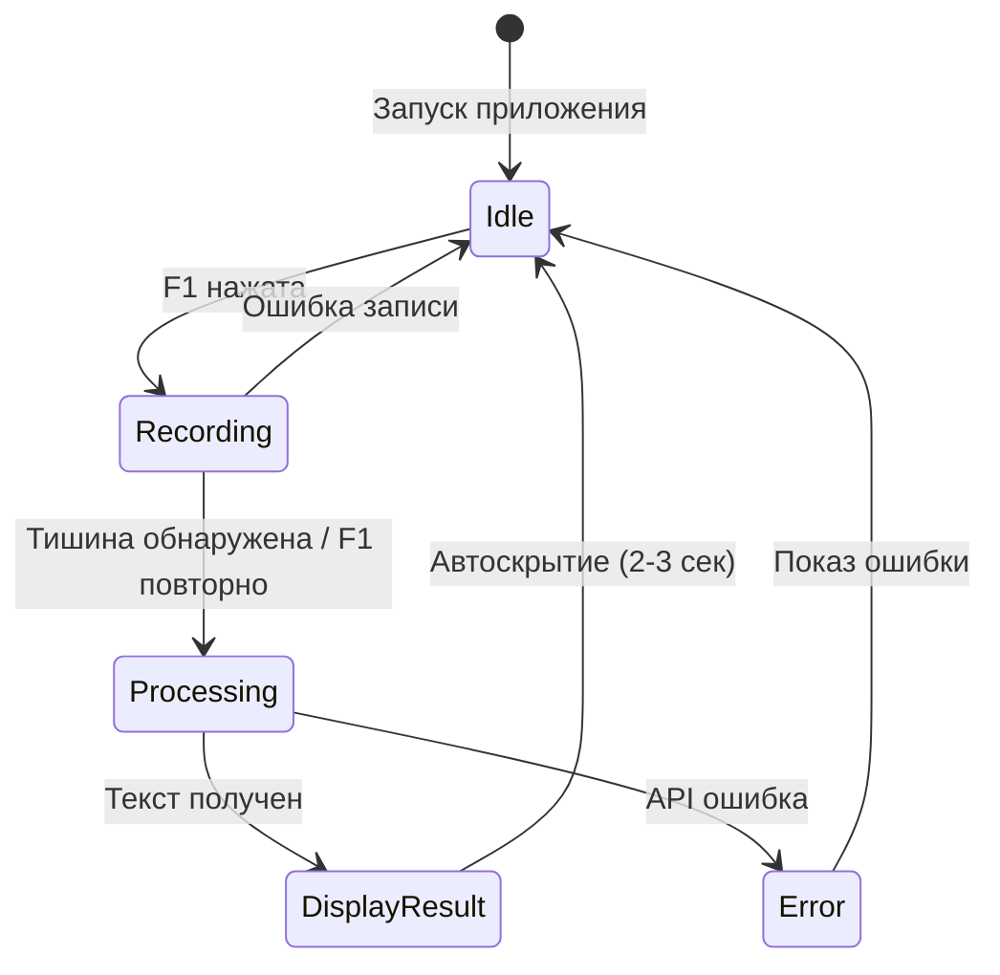

# Документ Проектирования: RapidWhisper

## Обзор

RapidWhisper - это настольное приложение на Python для транскрипции речи в текст в реальном времени, использующее Zhipu GLM API. Приложение реализует минималистичный плавающий интерфейс в стиле SuperWhisper с анимированной визуализацией звуковой волны, автоматическим определением тишины и мгновенным копированием результата в буфер обмена. we are using uv manger, if activated envr, dont activate


### Ключевые Особенности

- Глобальная активация через горячую клавишу (F1)
- Плавающее окно в форме "пилюли" с эффектом размытого стекла
- Реалтайм визуализация звуковой волны во время записи
- Автоматическое определение тишины для остановки записи
- Быстрая транскрипция через GLM API (1-2 секунды)
- Автоматическое копирование результата в буфер обмена
- Многопоточная архитектура для плавной работы UI

### Технологический Стек

- **Язык**: Python 3.11+
- **Менеджер пакетов**: uv с виртуальным окружением .venv
- **GUI Framework**: PyQt6 (для кастомных окон с эффектами размытия)
- **Аудио**: PyAudio + NumPy (запись и анализ)
- **AI SDK**: OpenAI Python Library (с настройкой на Zhipu GLM API)
- **Буфер обмена**: Pyperclip
- **Горячие клавиши**: keyboard или pynput
- **Конфигурация**: python-dotenv

## Архитектура

### Общая Структура

Приложение следует архитектуре Model-View-Controller (MVC) с дополнительным слоем сервисов:

```
┌─────────────────────────────────────────────────────────┐
│                    Main Application                      │
│                  (QApplication + Event Loop)             │
└────────────────────┬────────────────────────────────────┘
                     │
        ┌────────────┴────────────┐
        │                         │
┌───────▼────────┐       ┌───────▼────────┐
│  UI Layer      │       │  Service Layer │
│  (PyQt6)       │       │                │
├────────────────┤       ├────────────────┤
│ FloatingWindow │◄──────┤ HotkeyManager  │
│ WaveformWidget │       │ AudioEngine    │
│ StatusDisplay  │       │ GLMClient      │
└────────┬───────┘       │ ClipboardMgr   │
         │               └────────┬───────┘
         │                        │
         │               ┌────────▼───────┐
         └──────────────►│  State Manager │
                         │  (Координация) │
                         └────────────────┘
```

### Потоковая Модель

```
Main Thread (UI)
├── Event Loop (PyQt6)
├── Waveform Rendering (60 FPS)
└── User Interactions

Audio Thread
├── Microphone Recording
├── RMS Calculation
└── Silence Detection

API Thread
├── File Upload
├── GLM API Request
└── Response Processing
```

### Диаграмма Состояний



## Компоненты и Интерфейсы

### 1. Main Application (`main.py`)

**Ответственность**: Точка входа, инициализация компонентов, управление жизненным циклом.

```python
class RapidWhisperApp:
    """Главный класс приложения"""
    
    def __init__(self):
        self.config: Config
        self.state_manager: StateManager
        self.hotkey_manager: HotkeyManager
        self.audio_engine: AudioEngine
        self.glm_client: GLMClient
        self.clipboard_manager: ClipboardManager
        self.floating_window: FloatingWindow
    
    def initialize() -> None:
        """Инициализирует все компоненты приложения"""
        pass
    
    def run() -> None:
        """Запускает главный цикл событий"""
        pass
    
    def shutdown() -> None:
        """Корректно завершает работу приложения"""
        pass
```

### 2. FloatingWindow (`ui/floating_window.py`)

**Ответственность**: Плавающее окно с эффектами, анимациями и визуализацией.

```python
class FloatingWindow(QWidget):
    """Плавающее окно в форме пилюли"""
    
    def __init__(self, parent=None):
        self.waveform_widget: WaveformWidget
        self.status_label: QLabel
        self.animation_manager: AnimationManager
    
    def setup_window_properties() -> None:
        """Настраивает frameless, always-on-top, blur эффекты"""
        pass
    
    def show_at_center() -> None:
        """Показывает окно в центре экрана с fade-in анимацией"""
        pass
    
    def hide_with_animation() -> None:
        """Скрывает окно с fade-out анимацией"""
        pass
    
    def apply_blur_effect() -> None:
        """Применяет эффект размытого стекла (platform-specific)"""
        pass
    
    def paintEvent(event: QPaintEvent) -> None:
        """Отрисовывает скругленный фон"""
        pass
```

**Стилизация**:
- Форма: Скругленный прямоугольник (border-radius: 30px)
- Размер: 400x120 пикселей (может варьироваться)
- Фон: rgba(0, 0, 0, 150) с blur эффектом
- Флаги: Qt.FramelessWindowHint | Qt.WindowStaysOnTopHint | Qt.Tool

### 3. WaveformWidget (`ui/waveform_widget.py`)

**Ответственность**: Визуализация звуковой волны и индикаторов загрузки.

```python
class WaveformWidget(QWidget):
    """Виджет для отрисовки звуковой волны"""
    
    def __init__(self, parent=None):
        self.rms_values: List[float] = []
        self.max_bars: int = 50
        self.animation_state: AnimationState
        self.timer: QTimer
    
    def update_rms(rms: float) -> None:
        """Обновляет значение RMS для визуализации"""
        pass
    
    def start_recording_animation() -> None:
        """Запускает анимацию волны"""
        pass
    
    def start_loading_animation() -> None:
        """Переключается на спиннер загрузки"""
        pass
    
    def stop_animation() -> None:
        """Останавливает все анимации"""
        pass
    
    def paintEvent(event: QPaintEvent) -> None:
        """Отрисовывает волну или спиннер"""
        pass
    
    def _draw_waveform(painter: QPainter) -> None:
        """Рисует звуковую волну из RMS значений"""
        pass
    
    def _draw_spinner(painter: QPainter) -> None:
        """Рисует вращающийся индикатор загрузки"""
        pass
```

**Алгоритм Визуализации Волны**:
1. Поддерживать скользящее окно из последних 50 RMS значений
2. Нормализовать значения в диапазон [0, 1]
3. Применить сглаживание (moving average или exponential smoothing)
4. Отрисовать вертикальные бары с высотой пропорциональной RMS
5. Использовать градиент цвета для эстетики (например, от синего к зеленому)

### 4. HotkeyManager (`services/hotkey_manager.py`)

**Ответственность**: Регистрация и обработка глобальных горячих клавиш.

```python
class HotkeyManager:
    """Менеджер глобальных горячих клавиш"""
    
    def __init__(self, callback: Callable):
        self.hotkey: str = "F1"
        self.callback: Callable
        self.listener: keyboard.Listener
    
    def register_hotkey(key: str) -> bool:
        """Регистрирует глобальную горячую клавишу"""
        pass
    
    def unregister_hotkey() -> None:
        """Отменяет регистрацию горячей клавиши"""
        pass
    
    def _on_hotkey_pressed() -> None:
        """Callback при нажатии горячей клавиши"""
        pass
```

**Реализация**:
- Использовать библиотеку `keyboard` для Windows/Linux
- Для macOS может потребоваться `pynput` с правами доступа
- Обработка конфликтов с системными горячими клавишами

### 5. AudioEngine (`services/audio_engine.py`)

**Ответственность**: Запись аудио, вычисление RMS, определение тишины.

```python
class AudioEngine:
    """Движок для записи и обработки аудио"""
    
    def __init__(self):
        self.sample_rate: int = 16000
        self.channels: int = 1
        self.chunk_size: int = 1024
        self.audio_buffer: List[bytes] = []
        self.stream: pyaudio.Stream
        self.is_recording: bool = False
        self.silence_detector: SilenceDetector
    
    def start_recording() -> None:
        """Начинает запись с микрофона"""
        pass
    
    def stop_recording() -> str:
        """Останавливает запись и возвращает путь к файлу"""
        pass
    
    def get_current_rms() -> float:
        """Возвращает текущее RMS значение громкости"""
        pass
    
    def _audio_callback(in_data, frame_count, time_info, status) -> tuple:
        """Callback для обработки аудио потока"""
        pass
    
    def _save_to_wav(filepath: str) -> None:
        """Сохраняет буфер в WAV файл"""
        pass
```

**Параметры Записи**:
- Sample Rate: 16000 Hz (оптимально для речи)
- Channels: 1 (моно)
- Format: pyaudio.paInt16
- Chunk Size: 1024 frames

### 6. SilenceDetector (`services/silence_detector.py`)

**Ответственность**: Определение тишины для автоматической остановки записи.

```python
class SilenceDetector:
    """Детектор тишины в аудио потоке"""
    
    def __init__(self):
        self.threshold: float = 0.02  # Порог RMS
        self.silence_duration: float = 1.5  # Секунды
        self.silence_start_time: Optional[float] = None
        self.background_noise_level: float = 0.0
    
    def update(rms: float, timestamp: float) -> bool:
        """Обновляет состояние и возвращает True если тишина обнаружена"""
        pass
    
    def calibrate_background_noise(rms_samples: List[float]) -> None:
        """Калибрует порог на основе фонового шума"""
        pass
    
    def reset() -> None:
        """Сбрасывает состояние детектора"""
        pass
```

**Алгоритм**:
1. Вычислить адаптивный порог: `threshold = background_noise * 2.0`
2. Если RMS < threshold, начать отсчет времени тишины
3. Если RMS >= threshold, сбросить отсчет
4. Если время тишины >= 1.5 сек, вернуть True
5. Игнорировать короткие паузы (< 0.5 сек) через debouncing

### 7. GLMClient (`services/glm_client.py`)

**Ответственность**: Взаимодействие с Zhipu GLM API для транскрипции.

```python
class GLMClient:
    """Клиент для Zhipu GLM API"""
    
    def __init__(self, api_key: str):
        self.client: openai.OpenAI
        self.base_url: str = "https://open.bigmodel.cn/api/paas/v4/"
        self.model: str = "whisper-1"
        self.timeout: int = 30
    
    def transcribe_audio(audio_file_path: str) -> str:
        """Отправляет аудио на транскрипцию и возвращает текст"""
        pass
    
    def _prepare_audio_file(filepath: str) -> BinaryIO:
        """Подготавливает аудио файл для отправки"""
        pass
    
    def _handle_api_error(error: Exception) -> str:
        """Обрабатывает ошибки API и возвращает понятное сообщение"""
        pass
```

**Конфигурация OpenAI SDK**:
```python
client = openai.OpenAI(
    api_key=os.getenv("GLM_API_KEY"),
    base_url="https://open.bigmodel.cn/api/paas/v4/"
)

response = client.audio.transcriptions.create(
    model="whisper-1",
    file=audio_file,
    response_format="json"
)
```

### 8. ClipboardManager (`services/clipboard_manager.py`)

**Ответственность**: Управление буфером обмена.

```python
class ClipboardManager:
    """Менеджер буфера обмена"""
    
    def copy_to_clipboard(text: str) -> bool:
        """Копирует текст в буфер обмена"""
        pass
    
    def get_from_clipboard() -> str:
        """Получает текст из буфера обмена"""
        pass
```

**Реализация**:
- Использовать `pyperclip.copy()` для кроссплатформенности
- Обработка ошибок при недоступности буфера обмена

### 9. StateManager (`core/state_manager.py`)

**Ответственность**: Координация состояний приложения и взаимодействия компонентов.

```python
class AppState(Enum):
    """Состояния приложения"""
    IDLE = "idle"
    RECORDING = "recording"
    PROCESSING = "processing"
    DISPLAYING = "displaying"
    ERROR = "error"

class StateManager:
    """Менеджер состояний приложения"""
    
    def __init__(self):
        self.current_state: AppState = AppState.IDLE
        self.state_changed = Signal(AppState)  # PyQt Signal
    
    def transition_to(new_state: AppState) -> None:
        """Переходит в новое состояние"""
        pass
    
    def on_hotkey_pressed() -> None:
        """Обрабатывает нажатие горячей клавиши"""
        pass
    
    def on_silence_detected() -> None:
        """Обрабатывает обнаружение тишины"""
        pass
    
    def on_transcription_complete(text: str) -> None:
        """Обрабатывает завершение транскрипции"""
        pass
    
    def on_error(error: Exception) -> None:
        """Обрабатывает ошибки"""
        pass
```

**Логика Переходов Состояний**:

```
IDLE + hotkey_pressed:
  → Показать окно
  → Начать запись
  → Переход в RECORDING

RECORDING + silence_detected OR hotkey_pressed:
  → Остановить запись
  → Показать спиннер
  → Переход в PROCESSING
  → Запустить транскрипцию в отдельном потоке

PROCESSING + transcription_complete:
  → Скрыть спиннер
  → Показать текст
  → Копировать в буфер
  → Переход в DISPLAYING
  → Запустить таймер автоскрытия

DISPLAYING + timeout OR hotkey_pressed:
  → Скрыть окно
  → Переход в IDLE

ERROR + timeout:
  → Скрыть окно
  → Переход в IDLE
```

### 10. Config (`core/config.py`)

**Ответственность**: Загрузка и управление конфигурацией.

```python
class Config:
    """Конфигурация приложения"""
    
    def __init__(self):
        self.glm_api_key: str
        self.hotkey: str = "F1"
        self.silence_threshold: float = 0.02
        self.silence_duration: float = 1.5
        self.auto_hide_delay: float = 2.5
        self.window_width: int = 400
        self.window_height: int = 120
    
    @staticmethod
    def load_from_env() -> Config:
        """Загружает конфигурацию из .env файла"""
        pass
    
    def validate() -> List[str]:
        """Валидирует конфигурацию и возвращает список ошибок"""
        pass
```

## Модели Данных

### AudioData

```python
@dataclass
class AudioData:
    """Данные записанного аудио"""
    sample_rate: int
    channels: int
    frames: bytes
    duration: float
    rms_values: List[float]
    
    def save_to_file(filepath: str) -> None:
        """Сохраняет аудио в WAV файл"""
        pass
```

### TranscriptionResult

```python
@dataclass
class TranscriptionResult:
    """Результат транскрипции"""
    text: str
    duration: float
    language: Optional[str] = None
    confidence: Optional[float] = None
    
    def get_preview(max_length: int = 100) -> str:
        """Возвращает превью текста для отображения"""
        pass
```

### ErrorInfo

```python
@dataclass
class ErrorInfo:
    """Информация об ошибке"""
    error_type: str
    message: str
    user_message: str
    timestamp: datetime
    
    def log_to_file(log_path: str) -> None:
        """Записывает ошибку в лог файл"""
        pass
```

## Детали Реализации

### Эффект Размытого Стекла (Blur Effect)

**Windows 11**:
```python
from ctypes import windll, c_int, byref

def apply_windows_blur(hwnd):
    """Применяет Acrylic эффект на Windows 11"""
    accent_state = 3  # ACCENT_ENABLE_BLURBEHIND
    accent_policy = AccentPolicy()
    accent_policy.AccentState = accent_state
    accent_policy.AccentFlags = 2
    accent_policy.GradientColor = 0x01000000
    
    data = WindowCompositionAttribData()
    data.Attribute = 19  # WCA_ACCENT_POLICY
    data.Data = byref(accent_policy)
    data.SizeOfData = sizeof(accent_policy)
    
    windll.user32.SetWindowCompositionAttribute(hwnd, byref(data))
```

**macOS**:
```python
def apply_macos_blur(window):
    """Применяет NSVisualEffectView на macOS"""
    # Требует использования PyObjC
    from Cocoa import NSVisualEffectView, NSVisualEffectBlendingModeBehindWindow
    
    view = NSVisualEffectView.alloc().initWithFrame_(window.frame())
    view.setBlendingMode_(NSVisualEffectBlendingModeBehindWindow)
    window.contentView().addSubview_(view)
```

**Linux**:
```python
def apply_linux_blur(window):
    """Применяет композитный эффект на Linux (KDE/GNOME)"""
    # Использовать Qt GraphicsEffect
    blur = QGraphicsBlurEffect()
    blur.setBlurRadius(20)
    window.setGraphicsEffect(blur)
```

### Многопоточная Запись Аудио

```python
class AudioRecordingThread(QThread):
    """Поток для записи аудио"""
    rms_updated = Signal(float)
    recording_stopped = Signal(str)  # filepath
    
    def run(self):
        """Главный цикл записи"""
        stream = pyaudio.PyAudio().open(
            format=pyaudio.paInt16,
            channels=1,
            rate=16000,
            input=True,
            frames_per_buffer=1024,
            stream_callback=self._callback
        )
        
        stream.start_stream()
        
        while self.is_recording:
            time.sleep(0.01)
        
        stream.stop_stream()
        stream.close()
        
        filepath = self._save_audio()
        self.recording_stopped.emit(filepath)
    
    def _callback(self, in_data, frame_count, time_info, status):
        """Обрабатывает аудио чанки"""
        self.audio_buffer.append(in_data)
        
        # Вычислить RMS
        audio_array = np.frombuffer(in_data, dtype=np.int16)
        rms = np.sqrt(np.mean(audio_array**2)) / 32768.0
        
        self.rms_updated.emit(rms)
        
        return (in_data, pyaudio.paContinue)
```

### Асинхронная Транскрипция

```python
class TranscriptionThread(QThread):
    """Поток для транскрипции через API"""
    transcription_complete = Signal(str)
    transcription_error = Signal(str)
    
    def __init__(self, glm_client: GLMClient, audio_path: str):
        super().__init__()
        self.glm_client = glm_client
        self.audio_path = audio_path
    
    def run(self):
        """Выполняет транскрипцию"""
        try:
            text = self.glm_client.transcribe_audio(self.audio_path)
            self.transcription_complete.emit(text)
        except Exception as e:
            self.transcription_error.emit(str(e))
        finally:
            # Удалить временный файл
            if os.path.exists(self.audio_path):
                os.remove(self.audio_path)
```

### Анимации с QPropertyAnimation

```python
class AnimationManager:
    """Менеджер анимаций для окна"""
    
    def fade_in(widget: QWidget, duration: int = 300):
        """Анимация появления"""
        effect = QGraphicsOpacityEffect()
        widget.setGraphicsEffect(effect)
        
        animation = QPropertyAnimation(effect, b"opacity")
        animation.setDuration(duration)
        animation.setStartValue(0.0)
        animation.setEndValue(1.0)
        animation.setEasingCurve(QEasingCurve.InOutQuad)
        animation.start()
        
        return animation
    
    def fade_out(widget: QWidget, duration: int = 300):
        """Анимация исчезновения"""
        effect = widget.graphicsEffect()
        if not effect:
            effect = QGraphicsOpacityEffect()
            widget.setGraphicsEffect(effect)
        
        animation = QPropertyAnimation(effect, b"opacity")
        animation.setDuration(duration)
        animation.setStartValue(1.0)
        animation.setEndValue(0.0)
        animation.setEasingCurve(QEasingCurve.InOutQuad)
        animation.finished.connect(widget.hide)
        animation.start()
        
        return animation
```

### Структура Проекта

```
RapidWhisper/
├── .venv/                      # Виртуальное окружение
├── .env                        # Конфигурация (GLM_API_KEY)
├── .gitignore
├── pyproject.toml              # uv конфигурация
├── README.md
├── main.py                     # Точка входа
├── core/
│   ├── __init__.py
│   ├── config.py               # Конфигурация
│   └── state_manager.py        # Менеджер состояний
├── ui/
│   ├── __init__.py
│   ├── floating_window.py      # Главное окно
│   ├── waveform_widget.py      # Визуализация волны
│   └── styles.py               # QSS стили
├── services/
│   ├── __init__.py
│   ├── audio_engine.py         # Запись аудио
│   ├── silence_detector.py     # Детектор тишины
│   ├── glm_client.py           # GLM API клиент
│   ├── clipboard_manager.py    # Буфер обмена
│   └── hotkey_manager.py       # Горячие клавиши
├── models/
│   ├── __init__.py
│   └── data_models.py          # Модели данных
├── utils/
│   ├── __init__.py
│   ├── logger.py               # Логирование
│   └── platform_utils.py       # Платформо-зависимые утилиты
└── tests/
    ├── __init__.py
    ├── test_audio_engine.py
    ├── test_silence_detector.py
    ├── test_glm_client.py
    └── test_state_manager.py
```


## Свойства Корректности

Свойство - это характеристика или поведение, которое должно выполняться во всех допустимых выполнениях системы - по сути, формальное утверждение о том, что система должна делать. Свойства служат мостом между человекочитаемыми спецификациями и машинно-проверяемыми гарантиями корректности.

### Property Reflection

После анализа всех критериев приемки, были выявлены следующие области избыточности:

1. **Конфигурационные свойства (11.2-11.4)** можно объединить в одно свойство о настраиваемости параметров
2. **Свойства потоков (9.1, 9.2, 4.7)** можно объединить в одно свойство о многопоточности
3. **Свойства анимации fade (2.7, 2.8, 8.4)** следуют одному паттерну изменения прозрачности
4. **Свойства очистки ресурсов (12.2, 12.3, 9.6)** можно объединить в одно свойство о корректном освобождении ресурсов

### Свойства

**Property 1: Глобальная активация горячей клавиши**
*Для любого* состояния приложения и любого активного окна, нажатие зарегистрированной горячей клавиши должно активировать приложение независимо от текущего фокуса
**Validates: Requirements 1.2, 1.4**

**Property 2: Центрирование окна**
*Для любого* разрешения экрана, плавающее окно должно отображаться в центре экрана с координатами (screen_width/2 - window_width/2, screen_height/2 - window_height/2)
**Validates: Requirements 2.2**

**Property 3: Анимация прозрачности**
*Для любого* виджета с анимацией fade-in или fade-out, значение прозрачности должно плавно изменяться от начального к конечному значению за указанную длительность
**Validates: Requirements 2.7, 2.8, 8.4**

**Property 4: Запуск записи при показе окна**
*Для любого* момента показа плавающего окна, аудио движок должен немедленно начать запись с микрофона
**Validates: Requirements 3.1**

**Property 5: Рост аудио буфера**
*Для любого* активного процесса записи, размер аудио буфера должен монотонно возрастать с течением времени
**Validates: Requirements 3.4**

**Property 6: Создание файла после остановки**
*Для любой* завершенной записи, должен существовать временный WAV файл с записанными аудио данными
**Validates: Requirements 3.5**

**Property 7: Обновление визуализации волны**
*Для любого* активного процесса записи, визуализатор волны должен получать обновления RMS значений с частотой не менее 20 раз в секунду
**Validates: Requirements 4.1, 4.2**

**Property 8: Корректность вычисления RMS**
*Для любого* аудио буфера с известными значениями, вычисленное RMS должно равняться sqrt(mean(samples^2)) / 32768.0
**Validates: Requirements 4.3**

**Property 9: Пропорциональность амплитуды RMS**
*Для любых* двух RMS значений rms1 и rms2, где rms1 > rms2, высота визуализации для rms1 должна быть больше высоты для rms2
**Validates: Requirements 4.4**

**Property 10: Плавность интерполяции**
*Для любых* двух последовательных значений визуализации, разница между ними не должна превышать максимальный порог изменения за один кадр
**Validates: Requirements 4.6**

**Property 11: Непрерывный анализ громкости**
*Для любого* активного процесса записи, детектор тишины должен получать RMS обновления для каждого аудио чанка
**Validates: Requirements 5.1**

**Property 12: Обнаружение тишины по времени**
*Для любой* последовательности RMS значений, где все значения ниже порога в течение 1.5 секунд, детектор должен инициировать остановку записи
**Validates: Requirements 5.2**

**Property 13: Адаптивный порог тишины**
*Для любого* уровня фонового шума, порог тишины должен вычисляться как background_noise_level * adaptive_multiplier
**Validates: Requirements 5.3**

**Property 14: Игнорирование коротких пауз**
*Для любой* последовательности RMS с паузами менее 0.5 секунды, детектор не должен инициировать остановку записи
**Validates: Requirements 5.4**

**Property 15: Переход к обработке при тишине**
*Для любого* обнаружения тишины во время записи, приложение должно перейти в состояние PROCESSING
**Validates: Requirements 5.5**

**Property 16: Извлечение текста из ответа API**
*Для любого* валидного JSON ответа от GLM API, клиент должен корректно извлечь текстовое поле транскрипции
**Validates: Requirements 6.6**

**Property 17: Отправка аудио на транскрипцию**
*Для любого* завершенного аудио файла, GLM клиент должен отправить файл на транскрипцию через API
**Validates: Requirements 6.3**

**Property 18: Трансформация визуализации**
*Для любого* перехода из состояния RECORDING в PROCESSING, визуализатор должен изменить режим отображения с волны на спиннер
**Validates: Requirements 7.1**

**Property 19: Отображение индикатора во время API запроса**
*Для любого* активного API запроса, приложение должно отображать анимированный индикатор прогресса
**Validates: Requirements 7.2**

**Property 20: Скрытие индикатора после ответа**
*Для любого* полученного ответа от API, индикатор загрузки должен быть скрыт
**Validates: Requirements 7.5**

**Property 21: Отображение текста в окне**
*Для любого* полученного текста от GLM API, текст должен отображаться внутри плавающего окна
**Validates: Requirements 8.1**

**Property 22: Копирование в буфер обмена**
*Для любого* полученного текста транскрипции, полный текст должен быть скопирован в системный буфер обмена
**Validates: Requirements 8.2**

**Property 23: Усечение длинного текста**
*Для любого* текста длиннее 100 символов, в окне должны отображаться только первые 100 символов
**Validates: Requirements 8.3**

**Property 24: Автоматическое скрытие окна**
*Для любого* отображенного результата, должен запуститься таймер автоматического скрытия окна с длительностью 2-3 секунды
**Validates: Requirements 8.6**

**Property 25: Отмена автоскрытия при наведении**
*Для любого* активного таймера автоскрытия, наведение курсора на окно должно отменить или приостановить таймер
**Validates: Requirements 8.7**

**Property 26: Многопоточная архитектура**
*Для любых* операций записи аудио, API запросов и визуализации, они должны выполняться в отдельных потоках от главного UI потока
**Validates: Requirements 9.1, 9.2, 4.7**

**Property 27: Частота обновления визуализации**
*Для любого* процесса визуализации волны, частота обновления должна быть не менее 20 FPS (кадров в секунду)
**Validates: Requirements 9.3**

**Property 28: Неблокирующий UI**
*Для любых* операций записи или обработки, главный UI поток должен оставаться отзывчивым и обрабатывать события
**Validates: Requirements 9.5**

**Property 29: Освобождение ресурсов микрофона**
*Для любой* остановленной записи, аудио поток должен быть закрыт и ресурсы микрофона освобождены
**Validates: Requirements 9.6**

**Property 30: Логирование ошибок**
*Для любой* возникшей ошибки, детали ошибки должны быть записаны в лог файл с временной меткой
**Validates: Requirements 10.5**

**Property 31: Восстановление после ошибки**
*Для любой* обработанной ошибки, приложение должно вернуться в состояние IDLE для возможности новой записи
**Validates: Requirements 10.6**

**Property 32: Настраиваемость параметров**
*Для любого* конфигурационного параметра (горячая клавиша, порог тишины, время автоскрытия), значение должно загружаться из конфигурационного файла, если оно там указано
**Validates: Requirements 11.2, 11.3, 11.4**

**Property 33: Значения по умолчанию**
*Для любого* отсутствующего конфигурационного параметра, должно использоваться предопределенное значение по умолчанию
**Validates: Requirements 11.5**

**Property 34: Очистка ресурсов при завершении**
*Для любого* завершения приложения, все ресурсы (микрофон, потоки, временные файлы, горячие клавиши) должны быть корректно освобождены
**Validates: Requirements 12.2, 12.3, 12.4, 9.6**

**Property 35: Удаление временных файлов**
*Для любой* успешной транскрипции, временный аудио файл должен быть удален после получения результата
**Validates: Requirements 12.3**

**Property 36: Сохранение логов**
*Для любой* сессии работы приложения, должен создаваться и пополняться лог файл с записями о событиях и ошибках
**Validates: Requirements 12.5**

**Property 37: Корректное завершение процесса**
*Для любого* закрытия приложения пользователем, процесс должен завершиться без зависших потоков или дочерних процессов
**Validates: Requirements 12.6**


## Обработка Ошибок

### Стратегия Обработки Ошибок

Приложение использует многоуровневую стратегию обработки ошибок:

1. **Уровень компонента**: Каждый компонент обрабатывает свои специфичные ошибки
2. **Уровень менеджера состояний**: Координирует обработку ошибок и переходы состояний
3. **Уровень UI**: Отображает понятные сообщения пользователю
4. **Уровень логирования**: Записывает детали для отладки

### Категории Ошибок

#### 1. Ошибки Аудио Устройств

**Микрофон недоступен**:
```python
try:
    stream = pyaudio.PyAudio().open(...)
except OSError as e:
    if "device unavailable" in str(e).lower():
        raise MicrophoneUnavailableError("Микрофон занят другим приложением")
    else:
        raise AudioDeviceError(f"Ошибка аудио устройства: {e}")
```

**Обработка**:
- Показать сообщение: "Микрофон занят другим приложением"
- Закрыть окно
- Вернуться в состояние IDLE
- Логировать детали ошибки

#### 2. Ошибки API

**Неверный API ключ**:
```python
try:
    response = client.audio.transcriptions.create(...)
except openai.AuthenticationError:
    raise APIKeyError("Проверьте GLM_API_KEY в .env файле")
```

**Сетевые ошибки**:
```python
try:
    response = client.audio.transcriptions.create(...)
except (openai.APIConnectionError, requests.ConnectionError):
    raise NetworkError("Ошибка сети, проверьте подключение")
```

**Таймаут**:
```python
try:
    response = client.audio.transcriptions.create(..., timeout=30)
except openai.APITimeoutError:
    raise APITimeoutError("Превышено время ожидания ответа от API")
```

**Обработка**:
- Показать соответствующее сообщение об ошибке
- Удалить временный аудио файл
- Вернуться в состояние IDLE
- Логировать детали запроса и ответа

#### 3. Ошибки Валидации

**Слишком короткая запись**:
```python
if audio_duration < 0.5:
    raise RecordingTooShortError("Запись слишком короткая, попробуйте еще раз")
```

**Пустой аудио файл**:
```python
if len(audio_buffer) == 0:
    raise EmptyRecordingError("Не удалось записать аудио")
```

**Обработка**:
- Показать сообщение пользователю
- Удалить некорректный файл
- Вернуться в состояние IDLE

#### 4. Ошибки Конфигурации

**Отсутствующий API ключ**:
```python
api_key = os.getenv("GLM_API_KEY")
if not api_key:
    raise ConfigurationError("GLM_API_KEY не найден в .env файле")
```

**Конфликт горячих клавиш**:
```python
if not hotkey_manager.register_hotkey(config.hotkey):
    raise HotkeyConflictError(f"Не удалось зарегистрировать {config.hotkey}")
```

**Обработка**:
- Показать сообщение при запуске
- Предложить альтернативные варианты
- Использовать значения по умолчанию где возможно

### Иерархия Исключений

```python
class RapidWhisperError(Exception):
    """Базовый класс для всех ошибок приложения"""
    def __init__(self, message: str, user_message: str = None):
        self.message = message
        self.user_message = user_message or message
        super().__init__(self.message)

class AudioError(RapidWhisperError):
    """Ошибки аудио подсистемы"""
    pass

class MicrophoneUnavailableError(AudioError):
    """Микрофон недоступен"""
    pass

class RecordingTooShortError(AudioError):
    """Запись слишком короткая"""
    pass

class APIError(RapidWhisperError):
    """Ошибки API"""
    pass

class APIKeyError(APIError):
    """Неверный или отсутствующий API ключ"""
    pass

class NetworkError(APIError):
    """Сетевые ошибки"""
    pass

class ConfigurationError(RapidWhisperError):
    """Ошибки конфигурации"""
    pass
```

### Логирование

```python
import logging
from datetime import datetime

class ErrorLogger:
    """Логгер ошибок приложения"""
    
    def __init__(self, log_path: str = "rapidwhisper.log"):
        self.logger = logging.getLogger("RapidWhisper")
        self.logger.setLevel(logging.DEBUG)
        
        handler = logging.FileHandler(log_path, encoding='utf-8')
        formatter = logging.Formatter(
            '%(asctime)s - %(name)s - %(levelname)s - %(message)s'
        )
        handler.setFormatter(formatter)
        self.logger.addHandler(handler)
    
    def log_error(self, error: Exception, context: dict = None):
        """Логирует ошибку с контекстом"""
        error_info = {
            'type': type(error).__name__,
            'message': str(error),
            'timestamp': datetime.now().isoformat(),
            'context': context or {}
        }
        self.logger.error(f"Error occurred: {error_info}")
```

### Восстановление После Ошибок

**Принципы восстановления**:
1. Всегда возвращаться в состояние IDLE после ошибки
2. Освобождать все захваченные ресурсы
3. Удалять временные файлы
4. Сбрасывать внутреннее состояние компонентов
5. Готовность к новой попытке записи

**Реализация в StateManager**:
```python
def on_error(self, error: Exception):
    """Обрабатывает ошибку и восстанавливает состояние"""
    # Логировать ошибку
    self.error_logger.log_error(error, {
        'current_state': self.current_state.value,
        'timestamp': time.time()
    })
    
    # Показать сообщение пользователю
    if isinstance(error, RapidWhisperError):
        self.show_error_message(error.user_message)
    else:
        self.show_error_message("Произошла неожиданная ошибка")
    
    # Очистить ресурсы
    self.cleanup_resources()
    
    # Вернуться в IDLE
    self.transition_to(AppState.IDLE)
```


## Стратегия Тестирования

### Подход к Тестированию

RapidWhisper использует двойной подход к тестированию, сочетающий unit-тесты и property-based тесты для обеспечения корректности и надежности:

- **Unit-тесты**: Проверяют конкретные примеры, граничные случаи и условия ошибок
- **Property-based тесты**: Проверяют универсальные свойства на множестве входных данных
- Оба подхода дополняют друг друга и необходимы для полного покрытия

### Библиотека Property-Based Testing

Для Python будет использоваться **Hypothesis** - зрелая и мощная библиотека для property-based testing:

```python
pip install hypothesis
```

**Конфигурация Hypothesis**:
```python
from hypothesis import settings, HealthCheck

# Минимум 100 итераций для каждого property теста
settings.register_profile("rapidwhisper", 
    max_examples=100,
    deadline=None,
    suppress_health_check=[HealthCheck.too_slow]
)
settings.load_profile("rapidwhisper")
```

### Тегирование Property Тестов

Каждый property-based тест должен быть помечен комментарием, ссылающимся на свойство из документа проектирования:

```python
@given(st.floats(min_value=0.0, max_value=1.0))
def test_rms_calculation_correctness(rms_value):
    """
    Feature: rapid-whisper, Property 8: Корректность вычисления RMS
    
    Для любого аудио буфера с известными значениями, вычисленное RMS 
    должно равняться sqrt(mean(samples^2)) / 32768.0
    """
    # Test implementation
    pass
```

### Структура Тестов

```
tests/
├── unit/
│   ├── test_audio_engine.py
│   ├── test_silence_detector.py
│   ├── test_glm_client.py
│   ├── test_waveform_widget.py
│   ├── test_state_manager.py
│   ├── test_clipboard_manager.py
│   └── test_config.py
├── property/
│   ├── test_audio_properties.py
│   ├── test_silence_detection_properties.py
│   ├── test_visualization_properties.py
│   ├── test_state_transition_properties.py
│   └── test_resource_management_properties.py
├── integration/
│   ├── test_recording_flow.py
│   ├── test_transcription_flow.py
│   └── test_error_recovery.py
└── conftest.py  # Pytest fixtures
```

### Unit-тесты

#### Примеры Unit-тестов

**Тест конфигурации**:
```python
def test_config_loads_from_env(tmp_path):
    """Тест загрузки конфигурации из .env файла"""
    env_file = tmp_path / ".env"
    env_file.write_text("GLM_API_KEY=test_key_123\nHOTKEY=F2")
    
    config = Config.load_from_env(str(env_file))
    
    assert config.glm_api_key == "test_key_123"
    assert config.hotkey == "F2"

def test_config_uses_defaults_when_missing():
    """Тест использования значений по умолчанию"""
    config = Config()
    
    assert config.hotkey == "F1"
    assert config.silence_threshold == 0.02
    assert config.silence_duration == 1.5
```

**Тест обработки ошибок**:
```python
def test_microphone_unavailable_error():
    """Тест обработки недоступного микрофона"""
    audio_engine = AudioEngine()
    
    with patch('pyaudio.PyAudio.open', side_effect=OSError("device unavailable")):
        with pytest.raises(MicrophoneUnavailableError) as exc_info:
            audio_engine.start_recording()
        
        assert "Микрофон занят" in str(exc_info.value.user_message)

def test_short_recording_error():
    """Тест обработки слишком короткой записи"""
    audio_engine = AudioEngine()
    audio_engine.audio_buffer = [b'\x00' * 100]  # Очень короткий буфер
    
    with pytest.raises(RecordingTooShortError):
        audio_engine.stop_recording()
```

**Тест API клиента**:
```python
def test_glm_client_extracts_text_from_response():
    """Тест извлечения текста из ответа API"""
    client = GLMClient(api_key="test_key")
    
    mock_response = Mock()
    mock_response.text = "Привет, это тестовая транскрипция"
    
    with patch.object(client.client.audio.transcriptions, 'create', return_value=mock_response):
        result = client.transcribe_audio("test.wav")
        
        assert result == "Привет, это тестовая транскрипция"
```

### Property-Based Тесты

#### Примеры Property-Based Тестов

**Property 8: Корректность вычисления RMS**:
```python
from hypothesis import given
from hypothesis import strategies as st
import numpy as np

@given(st.lists(st.integers(min_value=-32768, max_value=32767), min_size=1, max_size=1024))
def test_rms_calculation_correctness(samples):
    """
    Feature: rapid-whisper, Property 8: Корректность вычисления RMS
    
    Для любого аудио буфера с известными значениями, вычисленное RMS 
    должно равняться sqrt(mean(samples^2)) / 32768.0
    """
    audio_engine = AudioEngine()
    audio_data = np.array(samples, dtype=np.int16)
    
    calculated_rms = audio_engine._calculate_rms(audio_data.tobytes())
    expected_rms = np.sqrt(np.mean(audio_data.astype(float)**2)) / 32768.0
    
    assert abs(calculated_rms - expected_rms) < 0.0001
```

**Property 9: Пропорциональность амплитуды RMS**:
```python
@given(
    st.floats(min_value=0.0, max_value=1.0),
    st.floats(min_value=0.0, max_value=1.0)
)
def test_amplitude_proportional_to_rms(rms1, rms2):
    """
    Feature: rapid-whisper, Property 9: Пропорциональность амплитуды RMS
    
    Для любых двух RMS значений rms1 и rms2, где rms1 > rms2, 
    высота визуализации для rms1 должна быть больше высоты для rms2
    """
    visualizer = WaveformWidget()
    
    height1 = visualizer._calculate_bar_height(rms1)
    height2 = visualizer._calculate_bar_height(rms2)
    
    if rms1 > rms2:
        assert height1 > height2
    elif rms1 < rms2:
        assert height1 < height2
    else:
        assert height1 == height2
```

**Property 12: Обнаружение тишины по времени**:
```python
@given(
    st.lists(
        st.floats(min_value=0.0, max_value=0.01),  # Значения ниже порога
        min_size=30,  # 1.5 сек при 20 обновлениях/сек
        max_size=30
    )
)
def test_silence_detection_triggers_after_duration(rms_values):
    """
    Feature: rapid-whisper, Property 12: Обнаружение тишины по времени
    
    Для любой последовательности RMS значений, где все значения ниже порога 
    в течение 1.5 секунд, детектор должен инициировать остановку записи
    """
    detector = SilenceDetector(threshold=0.02, silence_duration=1.5)
    
    silence_detected = False
    for i, rms in enumerate(rms_values):
        timestamp = i * 0.05  # 50ms между обновлениями
        if detector.update(rms, timestamp):
            silence_detected = True
            break
    
    assert silence_detected
```

**Property 14: Игнорирование коротких пауз**:
```python
@given(
    st.lists(
        st.floats(min_value=0.0, max_value=0.01),
        min_size=5,  # 0.25 сек - меньше порога 0.5 сек
        max_size=9   # 0.45 сек
    )
)
def test_short_pauses_ignored(short_pause_rms):
    """
    Feature: rapid-whisper, Property 14: Игнорирование коротких пауз
    
    Для любой последовательности RMS с паузами менее 0.5 секунды, 
    детектор не должен инициировать остановку записи
    """
    detector = SilenceDetector(threshold=0.02, silence_duration=1.5)
    
    silence_detected = False
    for i, rms in enumerate(short_pause_rms):
        timestamp = i * 0.05
        if detector.update(rms, timestamp):
            silence_detected = True
            break
    
    # Добавить громкий звук в конце
    detector.update(0.5, len(short_pause_rms) * 0.05)
    
    assert not silence_detected
```

**Property 23: Усечение длинного текста**:
```python
@given(st.text(min_size=101, max_size=1000))
def test_long_text_truncation(long_text):
    """
    Feature: rapid-whisper, Property 23: Усечение длинного текста
    
    Для любого текста длиннее 100 символов, в окне должны отображаться 
    только первые 100 символов
    """
    result = TranscriptionResult(text=long_text, duration=5.0)
    preview = result.get_preview(max_length=100)
    
    assert len(preview) <= 100
    assert preview == long_text[:100]
```

**Property 34: Очистка ресурсов при завершении**:
```python
@given(st.booleans(), st.booleans(), st.booleans())
def test_resource_cleanup_on_shutdown(has_audio, has_temp_files, has_hotkey):
    """
    Feature: rapid-whisper, Property 34: Очистка ресурсов при завершении
    
    Для любого завершения приложения, все ресурсы должны быть корректно освобождены
    """
    app = RapidWhisperApp()
    
    # Симулировать различные состояния ресурсов
    if has_audio:
        app.audio_engine.start_recording()
    if has_temp_files:
        app.temp_files.append("test_audio.wav")
    if has_hotkey:
        app.hotkey_manager.register_hotkey("F1")
    
    # Завершить приложение
    app.shutdown()
    
    # Проверить освобождение ресурсов
    assert not app.audio_engine.is_recording
    assert len(app.temp_files) == 0
    assert not app.hotkey_manager.is_registered
```

### Интеграционные Тесты

```python
def test_full_recording_to_transcription_flow(mock_glm_api):
    """Тест полного потока от записи до транскрипции"""
    app = RapidWhisperApp()
    app.initialize()
    
    # Симулировать нажатие горячей клавиши
    app.state_manager.on_hotkey_pressed()
    assert app.state_manager.current_state == AppState.RECORDING
    
    # Симулировать запись
    time.sleep(2)
    
    # Симулировать обнаружение тишины
    app.state_manager.on_silence_detected()
    assert app.state_manager.current_state == AppState.PROCESSING
    
    # Дождаться завершения транскрипции
    time.sleep(1)
    assert app.state_manager.current_state == AppState.DISPLAYING
    
    # Проверить, что текст в буфере обмена
    assert pyperclip.paste() == mock_glm_api.expected_text

def test_error_recovery_flow():
    """Тест восстановления после ошибки"""
    app = RapidWhisperApp()
    app.initialize()
    
    # Симулировать ошибку API
    with patch.object(app.glm_client, 'transcribe_audio', side_effect=NetworkError("Network error")):
        app.state_manager.on_hotkey_pressed()
        time.sleep(2)
        app.state_manager.on_silence_detected()
        
        # Дождаться обработки ошибки
        time.sleep(1)
        
        # Проверить возврат в IDLE
        assert app.state_manager.current_state == AppState.IDLE
        
        # Проверить, что можно начать новую запись
        app.state_manager.on_hotkey_pressed()
        assert app.state_manager.current_state == AppState.RECORDING
```

### Моки и Фикстуры

```python
# conftest.py
import pytest
from unittest.mock import Mock, patch

@pytest.fixture
def mock_pyaudio():
    """Мок PyAudio для тестирования без реального микрофона"""
    with patch('pyaudio.PyAudio') as mock:
        mock_stream = Mock()
        mock_stream.read.return_value = b'\x00' * 1024
        mock.return_value.open.return_value = mock_stream
        yield mock

@pytest.fixture
def mock_glm_api():
    """Мок GLM API для тестирования без реальных запросов"""
    with patch('openai.OpenAI') as mock:
        mock_response = Mock()
        mock_response.text = "Тестовая транскрипция"
        mock.return_value.audio.transcriptions.create.return_value = mock_response
        yield mock

@pytest.fixture
def temp_audio_file(tmp_path):
    """Создает временный аудио файл для тестов"""
    audio_file = tmp_path / "test_audio.wav"
    # Создать минимальный валидный WAV файл
    with wave.open(str(audio_file), 'wb') as wav:
        wav.setnchannels(1)
        wav.setsampwidth(2)
        wav.setframerate(16000)
        wav.writeframes(b'\x00' * 16000)  # 1 секунда тишины
    return str(audio_file)
```

### Покрытие Тестами

**Целевое покрытие**:
- Unit-тесты: 80%+ покрытие кода
- Property-тесты: Все 37 свойств корректности
- Интеграционные тесты: Основные пользовательские сценарии

**Запуск тестов**:
```bash
# Все тесты
pytest tests/

# Только unit-тесты
pytest tests/unit/

# Только property-тесты
pytest tests/property/

# С покрытием
pytest --cov=. --cov-report=html tests/

# Property-тесты с увеличенным числом примеров
pytest tests/property/ --hypothesis-profile=thorough
```

### Continuous Integration

```yaml
# .github/workflows/test.yml
name: Tests

on: [push, pull_request]

jobs:
  test:
    runs-on: ubuntu-latest
    steps:
      - uses: actions/checkout@v2
      - name: Set up Python
        uses: actions/setup-python@v2
        with:
          python-version: '3.11'
      - name: Install dependencies
        run: |
          pip install uv
          uv pip install -r requirements.txt
          uv pip install pytest hypothesis pytest-cov
      - name: Run tests
        run: pytest --cov=. --cov-report=xml tests/
      - name: Upload coverage
        uses: codecov/codecov-action@v2
```

