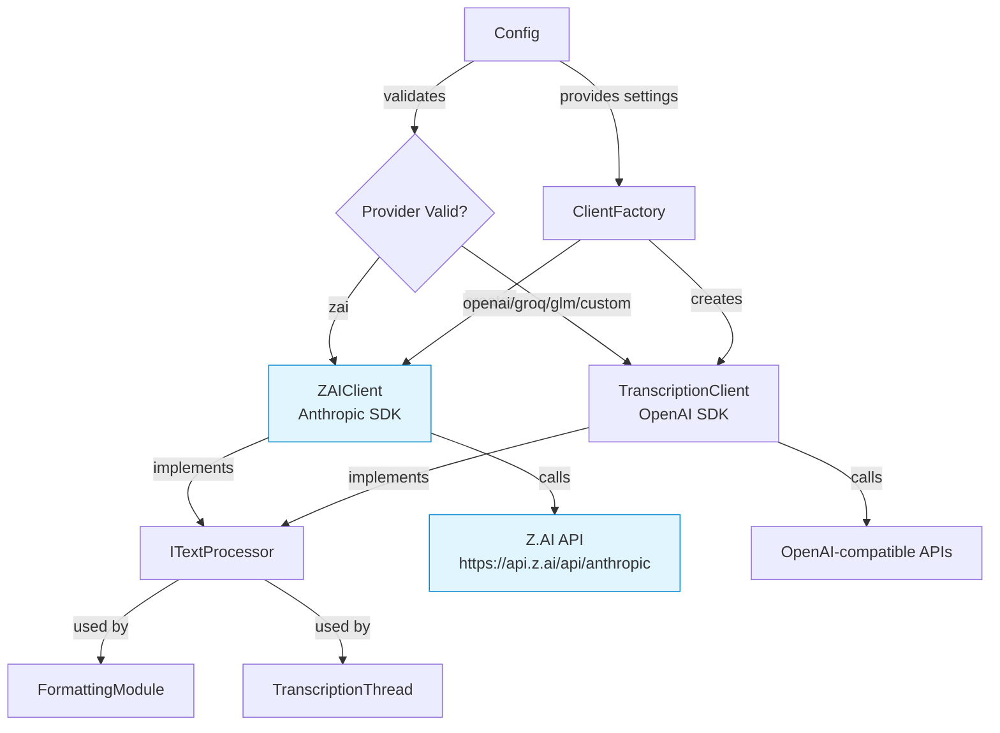
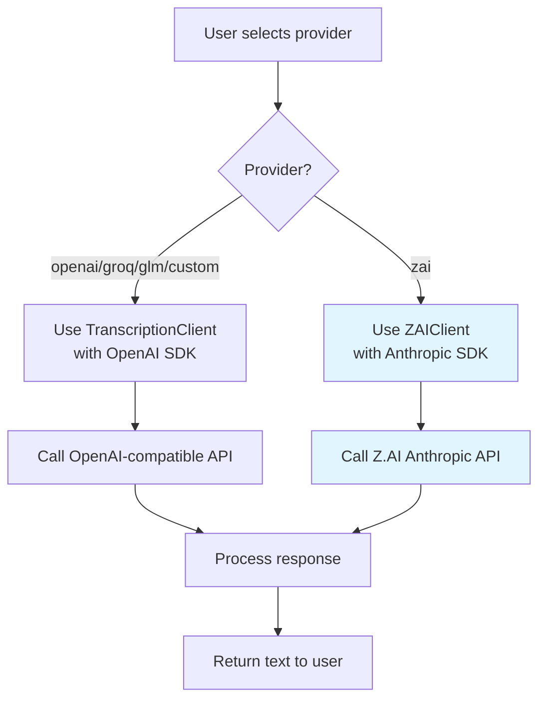

# Design Document: Z.AI Provider Integration

## Overview

Данный документ описывает дизайн интеграции нового AI провайдера Z.AI в приложение RapidWhisper. Z.AI представляет собой прокси-сервис, предоставляющий доступ к GLM-моделям через Anthropic-совместимый API. Ключевое отличие от существующих провайдеров - использование Anthropic SDK вместо OpenAI SDK.

### Key Design Decisions

1. **Создание отдельного ZAIClient класса**: Вместо расширения TranscriptionClient создается новый класс, так как Z.AI использует Anthropic SDK с другой структурой API
2. **Использование GLM_API_KEY**: Z.AI использует тот же API ключ что и GLM провайдер для упрощения конфигурации
3. **Адаптер для унификации интерфейса**: Создается адаптер для обеспечения единого интерфейса между OpenAI-based и Anthropic-based клиентами
4. **Опциональная поддержка транскрипции**: Транскрипция аудио реализуется только если Z.AI API поддерживает эту функцию

## Architecture

### Component Diagram



### Provider Selection Flow



## Components and Interfaces

### 1. ITextProcessor Interface

Унифицированный интерфейс для всех AI клиентов (как OpenAI-based, так и Anthropic-based).

```python
from abc import ABC, abstractmethod
from typing import Optional

class ITextProcessor(ABC):
    """
    Unified interface for AI text processing clients.
    
    This interface abstracts away the differences between OpenAI SDK
    and Anthropic SDK, providing a consistent API for text processing.
    """
    
    @abstractmethod
    def process_text(
        self, 
        text: str, 
        system_prompt: str, 
        temperature: float = 0.3,
        max_tokens: int = 2000
    ) -> str:
        """
        Process text using AI model.
        
        Args:
            text: Input text to process
            system_prompt: System prompt for the model
            temperature: Sampling temperature (0.0-1.0)
            max_tokens: Maximum tokens in response
        
        Returns:
            Processed text
        
        Raises:
            APIError: On API errors
            APIAuthenticationError: On authentication errors
            APITimeoutError: On timeout errors
        """
        pass
    
    @abstractmethod
    def transcribe_audio(self, audio_file_path: str) -> str:
        """
        Transcribe audio file to text.
        
        Args:
            audio_file_path: Path to audio file
        
        Returns:
            Transcribed text
        
        Raises:
            NotImplementedError: If transcription not supported
            APIError: On API errors
        """
        pass
```

### 2. ZAIClient Class

Новый клиент для работы с Z.AI через Anthropic SDK.

```python
from anthropic import Anthropic, AuthenticationError, APIConnectionError, APITimeoutError
from typing import Optional
import os

class ZAIClient(ITextProcessor):
    """
    Client for Z.AI API using Anthropic SDK.
    
    Z.AI is a proxy service that provides access to GLM models
    through an Anthropic-compatible API.
    
    Attributes:
        client: Anthropic client instance
        model: Model name (default: GLM-4.7)
        base_url: Z.AI API endpoint
        timeout: Request timeout in seconds
    """
    
    def __init__(
        self, 
        api_key: str,
        model: str = "GLM-4.7",
        base_url: str = "https://api.z.ai/api/anthropic",
        timeout: float = 130.0
    ):
        """
        Initialize Z.AI client.
        
        Args:
            api_key: GLM API key (same as used for GLM provider)
            model: Model name (default: GLM-4.7)
            base_url: Z.AI API endpoint
            timeout: Request timeout in seconds (default: 130.0)
        
        Raises:
            InvalidAPIKeyError: If API key is empty or None
        """
        from utils.exceptions import InvalidAPIKeyError
        
        if not api_key:
            raise InvalidAPIKeyError(provider="zai")
        
        self.model = model
        self.base_url = base_url
        self.timeout = timeout
        
        # Initialize Anthropic client with Z.AI endpoint
        self.client = Anthropic(
            api_key=api_key,
            base_url=base_url,
            timeout=timeout
        )
    
    def process_text(
        self, 
        text: str, 
        system_prompt: str, 
        temperature: float = 0.3,
        max_tokens: int = 2000
    ) -> str:
        """
        Process text using Z.AI API.
        
        Args:
            text: Input text to process
            system_prompt: System prompt for the model
            temperature: Sampling temperature (0.0-1.0)
            max_tokens: Maximum tokens in response
        
        Returns:
            Processed text
        
        Raises:
            APIAuthenticationError: On authentication errors
            APINetworkError: On network errors
            APITimeoutError: On timeout errors
            APIResponseError: On invalid response format
        """
        from utils.logger import get_logger
        from utils.exceptions import (
            APIAuthenticationError,
            APINetworkError,
            APITimeoutError as CustomAPITimeoutError,
            APIResponseError
        )
        
        logger = get_logger()
        
        try:
            logger.info(f"Sending request to Z.AI: model={self.model}")
            
            # Call Z.AI API using Anthropic SDK
            response = self.client.messages.create(
                model=self.model,
                max_tokens=max_tokens,
                temperature=temperature,
                system=system_prompt,
                messages=[
                    {"role": "user", "content": text}
                ]
            )
            
            # Extract text from response
            # Anthropic response format: response.content[0].text
            if response.content and len(response.content) > 0:
                processed_text = response.content[0].text
                
                if processed_text:
                    logger.info(f"Received response from Z.AI: {len(processed_text)} chars")
                    return processed_text.strip()
                else:
                    logger.warning("Z.AI response content is empty")
                    raise APIResponseError(
                        message="Z.AI response content is empty"
                    )
            else:
                logger.error("Z.AI response does not contain content field")
                raise APIResponseError(
                    message="Z.AI response does not contain content field"
                )
        
        except AuthenticationError as e:
            logger.error(f"Z.AI authentication error: {e}")
            raise APIAuthenticationError(provider="zai", message=str(e))
        
        except APITimeoutError as e:
            logger.error(f"Z.AI timeout error: {e}")
            raise CustomAPITimeoutError(provider="zai", timeout=self.timeout)
        
        except APIConnectionError as e:
            logger.error(f"Z.AI connection error: {e}")
            raise APINetworkError(provider="zai", message=str(e))
        
        except Exception as e:
            logger.error(f"Z.AI unexpected error: {e}")
            import traceback
            logger.error(traceback.format_exc())
            raise APIResponseError(
                message=f"Z.AI error: {e}"
            )
    
    def transcribe_audio(self, audio_file_path: str) -> str:
        """
        Transcribe audio file using Z.AI.
        
        NOTE: Z.AI may not support audio transcription.
        This method is included for interface compatibility.
        
        Args:
            audio_file_path: Path to audio file
        
        Returns:
            Transcribed text
        
        Raises:
            NotImplementedError: If Z.AI doesn't support transcription
        """
        from utils.logger import get_logger
        logger = get_logger()
        
        logger.warning("Z.AI audio transcription is not yet implemented")
        raise NotImplementedError(
            "Z.AI does not currently support audio transcription. "
            "Please use OpenAI, Groq, or GLM for transcription."
        )
```

### 3. ClientFactory Class

Фабрика для создания правильного клиента в зависимости от провайдера.

```python
from typing import Union
from services.transcription_client import TranscriptionClient
from services.zai_client import ZAIClient

class ClientFactory:
    """
    Factory for creating AI client instances.
    
    This factory abstracts the creation of different client types
    (OpenAI-based vs Anthropic-based) based on the provider.
    """
    
    @staticmethod
    def create_client(
        provider: str,
        api_key: str,
        model: Optional[str] = None,
        base_url: Optional[str] = None
    ) -> ITextProcessor:
        """
        Create appropriate client based on provider.
        
        Args:
            provider: Provider name (openai, groq, glm, custom, zai)
            api_key: API key for the provider
            model: Model name (optional)
            base_url: Base URL for custom provider (optional)
        
        Returns:
            ITextProcessor: Client instance (TranscriptionClient or ZAIClient)
        
        Raises:
            InvalidConfigError: If provider is unknown
        """
        from utils.exceptions import InvalidConfigError
        
        provider = provider.lower()
        
        if provider == "zai":
            # Create Z.AI client with Anthropic SDK
            return ZAIClient(
                api_key=api_key,
                model=model or "GLM-4.7",
                base_url=base_url or "https://api.z.ai/api/anthropic",
                timeout=130.0
            )
        elif provider in ["openai", "groq", "glm", "custom"]:
            # Create TranscriptionClient with OpenAI SDK
            return TranscriptionClient(
                provider=provider,
                api_key=api_key,
                base_url=base_url,
                model=model
            )
        else:
            raise InvalidConfigError(
                parameter="provider",
                value=provider,
                reason="unknown provider"
            )
```

### 4. Config Updates

Обновления класса Config для поддержки Z.AI.

```python
# В core/config.py

class Config:
    def validate(self) -> List[str]:
        """Validate configuration and return list of errors."""
        errors: List[str] = []
        
        # Update valid providers list to include zai
        valid_providers = ["openai", "groq", "glm", "custom", "zai"]
        if self.ai_provider not in valid_providers:
            errors.append(
                f"AI_PROVIDER must be one of {valid_providers}, "
                f"got: {self.ai_provider}"
            )
        
        # Check API keys based on provider
        if self.ai_provider == "openai" and not self.openai_api_key:
            errors.append("OPENAI_API_KEY not found in secrets.json")
        elif self.ai_provider == "groq" and not self.groq_api_key:
            errors.append("GROQ_API_KEY not found in secrets.json")
        elif self.ai_provider == "glm" and not self.glm_api_key:
            errors.append("GLM_API_KEY not found in secrets.json")
        elif self.ai_provider == "zai" and not self.glm_api_key:
            # Z.AI uses GLM_API_KEY
            errors.append(
                "GLM_API_KEY not found in secrets.json. "
                "Z.AI uses the same API key as GLM provider."
            )
        elif self.ai_provider == "custom":
            if not self.custom_api_key:
                errors.append("CUSTOM_API_KEY not found in secrets.json")
            if not self.custom_base_url:
                errors.append("CUSTOM_BASE_URL not found in config.jsonc")
        
        # ... rest of validation
        
        return errors
```

## Data Models

### Provider Configuration

```python
# Configuration structure in config.jsonc
{
  "ai_provider": {
    "provider": "zai",  // New provider option
    "transcription_model": "GLM-4.7",  // Model for transcription (if supported)
    "api_keys": {
      // API keys are in secrets.json
    }
  }
}

# API keys in secrets.json
{
  "ai_provider": {
    "api_keys": {
      "glm": "your-glm-api-key-here"  // Same key used for Z.AI
    }
  }
}
```

### Response Format Mapping

```python
# OpenAI SDK response format (current providers)
{
  "text": "transcribed or processed text"
}

# Anthropic SDK response format (Z.AI)
{
  "content": [
    {
      "type": "text",
      "text": "processed text"
    }
  ]
}

# Unified extraction:
# OpenAI: response.text
# Anthropic: response.content[0].text
```


## Correctness Properties

*A property is a characteristic or behavior that should hold true across all valid executions of a system—essentially, a formal statement about what the system should do. Properties serve as the bridge between human-readable specifications and machine-verifiable correctness guarantees.*

### Property 1: ZAIClient Initialization Correctness

*For any* valid GLM API key, creating a ZAIClient should result in an Anthropic client configured with base_url="https://api.z.ai/api/anthropic", timeout=130.0, and the provided API key.

**Validates: Requirements 1.1, 1.2, 2.1**

### Property 2: Provider Validation Completeness

*For any* provider value in the set {"openai", "groq", "glm", "custom", "zai"}, Config.validate() should not return errors related to invalid provider.

**Validates: Requirements 1.5**

### Property 3: Client Factory Provider Routing

*For any* provider="zai" with valid API key, ClientFactory.create_client() should return an instance of ZAIClient (not TranscriptionClient).

**Validates: Requirements 3.1, 3.2**

### Property 4: Anthropic API Request Structure

*For any* text input and system prompt, when ZAIClient.process_text() is called, the underlying Anthropic client should receive a messages.create() call with parameters: model, max_tokens, temperature, system, and messages array.

**Validates: Requirements 2.2, 3.3**

### Property 5: Response Parsing Correctness

*For any* valid Anthropic API response containing content[0].text, ZAIClient.process_text() should extract and return the text value from response.content[0].text.

**Validates: Requirements 3.4, 9.2, 9.4**

### Property 6: Invalid API Key Rejection

*For any* empty or None API key, attempting to create a ZAIClient should raise InvalidAPIKeyError with provider="zai".

**Validates: Requirements 6.1**

### Property 7: Configuration Persistence Round-Trip

*For any* configuration change (provider="zai", glm_api_key, custom model), saving to config.jsonc/secrets.json and then loading with Config.load_from_config() should produce an equivalent configuration.

**Validates: Requirements 7.1, 7.2, 7.3, 7.4**

### Property 8: Backward Compatibility Preservation

*For any* existing provider in {"openai", "groq", "glm", "custom"}, ClientFactory.create_client() should return a TranscriptionClient instance that behaves identically to the pre-Z.AI implementation.

**Validates: Requirements 8.1, 8.2, 8.4**

### Property 9: Error Handling Completeness

*For any* error type in {AuthenticationError, APITimeoutError, APIConnectionError, NotFoundError, missing content field}, ZAIClient.process_text() should catch the error and raise the appropriate custom exception (APIAuthenticationError, APITimeoutError, APINetworkError, ModelNotFoundError, APIResponseError) with descriptive messages.

**Validates: Requirements 6.2, 6.3, 6.4, 6.5, 9.1, 9.3**

## Error Handling

### Error Types and Handling Strategy

```python
# Error hierarchy for Z.AI
APIError (base)
├── InvalidAPIKeyError
│   └── Raised when: API key is None or empty
│   └── User action: Check GLM_API_KEY in secrets.json
│
├── APIAuthenticationError
│   └── Raised when: Anthropic AuthenticationError
│   └── User action: Verify GLM_API_KEY is valid
│
├── APITimeoutError
│   └── Raised when: Request exceeds 130 seconds
│   └── User action: Check network connection, try again
│
├── APINetworkError
│   └── Raised when: Anthropic APIConnectionError
│   └── User action: Check internet connection
│
├── ModelNotFoundError
│   └── Raised when: Anthropic NotFoundError
│   └── User action: Verify model name (GLM-4.7)
│
└── APIResponseError
    └── Raised when: Response missing content field
    └── User action: Report to Z.AI support
```

### Error Recovery Strategy

1. **Graceful Degradation**: If Z.AI fails, system should continue with original text (no formatting/post-processing)
2. **User Notification**: All errors should be logged and shown to user with actionable messages
3. **Fallback Behavior**: For transcription, if Z.AI selected but not supported, show clear error directing user to use OpenAI/Groq/GLM
4. **Retry Logic**: No automatic retries (user can manually retry by triggering transcription again)

### Timeout Handling

```python
# Z.AI specific timeout configuration
TIMEOUT_CONFIG = {
    "connect": 10.0,  # Connection timeout
    "read": 130.0,    # Read timeout (Z.AI specific)
    "total": 130.0    # Total request timeout
}

# Anthropic client initialization
client = Anthropic(
    api_key=api_key,
    base_url="https://api.z.ai/api/anthropic",
    timeout=130.0  # Single timeout value for Anthropic SDK
)
```

## Testing Strategy

### Dual Testing Approach

The testing strategy combines unit tests for specific scenarios and property-based tests for comprehensive coverage:

- **Unit tests**: Verify specific examples, edge cases, and error conditions
- **Property tests**: Verify universal properties across all inputs
- Both approaches are complementary and necessary for comprehensive coverage

### Unit Testing Focus

Unit tests should focus on:
- Specific examples demonstrating correct behavior (e.g., default model="GLM-4.7")
- Integration points between components (Config, ClientFactory, FormattingModule)
- Edge cases and error conditions (empty API key, missing content field)
- UI integration (manual testing for settings window)

### Property-Based Testing Configuration

- **Library**: Use `hypothesis` for Python property-based testing
- **Minimum iterations**: 100 per property test (due to randomization)
- **Test tagging**: Each property test must reference its design document property
- **Tag format**: `# Feature: zai-provider, Property {number}: {property_text}`

### Test Coverage Requirements

#### 1. ZAIClient Unit Tests

```python
# Test file: tests/test_zai_client.py

def test_zai_client_initialization_with_defaults():
    """Test ZAIClient initializes with default values."""
    # Example test for default model and timeout
    # Validates: Requirements 1.3, 1.4
    pass

def test_zai_client_empty_api_key_raises_error():
    """Test ZAIClient raises InvalidAPIKeyError for empty API key."""
    # Example test for error handling
    # Validates: Requirements 6.1
    pass

def test_zai_client_transcribe_audio_not_implemented():
    """Test ZAIClient.transcribe_audio() raises NotImplementedError."""
    # Example test for unsupported feature
    # Validates: Requirements 4.1, 4.2
    pass

def test_zai_client_process_text_extracts_content():
    """Test ZAIClient.process_text() extracts text from response.content[0].text."""
    # Example test with mocked Anthropic response
    # Validates: Requirements 3.4, 9.2
    pass
```

#### 2. ZAIClient Property Tests

```python
# Test file: tests/test_zai_client_properties.py

from hypothesis import given, strategies as st

@given(api_key=st.text(min_size=1))
def test_property_zai_client_initialization(api_key):
    """
    Feature: zai-provider, Property 1: ZAIClient Initialization Correctness
    
    For any valid GLM API key, creating a ZAIClient should result in
    an Anthropic client configured with correct base_url and timeout.
    """
    # Property test for initialization
    # Validates: Requirements 1.1, 1.2, 2.1
    pass

@given(
    text=st.text(min_size=1),
    system_prompt=st.text(min_size=1),
    temperature=st.floats(min_value=0.0, max_value=1.0)
)
def test_property_anthropic_api_request_structure(text, system_prompt, temperature):
    """
    Feature: zai-provider, Property 4: Anthropic API Request Structure
    
    For any text input and system prompt, ZAIClient should call
    messages.create() with correct parameters.
    """
    # Property test for API request structure
    # Validates: Requirements 2.2, 3.3
    pass

@given(provider=st.sampled_from(["openai", "groq", "glm", "custom"]))
def test_property_backward_compatibility(provider):
    """
    Feature: zai-provider, Property 8: Backward Compatibility Preservation
    
    For any existing provider, ClientFactory should return
    TranscriptionClient with unchanged behavior.
    """
    # Property test for backward compatibility
    # Validates: Requirements 8.1, 8.2, 8.4
    pass
```

#### 3. Config Integration Tests

```python
# Test file: tests/test_config_zai_integration.py

def test_config_validates_zai_provider():
    """Test Config.validate() accepts 'zai' as valid provider."""
    # Integration test for config validation
    # Validates: Requirements 1.5
    pass

def test_config_requires_glm_api_key_for_zai():
    """Test Config.validate() requires GLM_API_KEY when provider='zai'."""
    # Integration test for API key validation
    # Validates: Requirements 1.2
    pass

def test_config_persistence_round_trip():
    """Test saving and loading config preserves zai settings."""
    # Integration test for config persistence
    # Validates: Requirements 7.1, 7.2, 7.3, 7.4
    pass
```

#### 4. ClientFactory Integration Tests

```python
# Test file: tests/test_client_factory_zai.py

def test_client_factory_creates_zai_client():
    """Test ClientFactory creates ZAIClient for provider='zai'."""
    # Integration test for factory routing
    # Validates: Requirements 3.1, 3.2
    pass

def test_client_factory_creates_transcription_client_for_others():
    """Test ClientFactory creates TranscriptionClient for non-zai providers."""
    # Integration test for backward compatibility
    # Validates: Requirements 8.1, 8.2
    pass
```

#### 5. FormattingModule Integration Tests

```python
# Test file: tests/test_formatting_module_zai.py

def test_formatting_module_uses_zai_client():
    """Test FormattingModule uses ZAIClient when provider='zai'."""
    # Integration test for formatting integration
    # Validates: Requirements 3.2
    pass

def test_formatting_module_handles_zai_errors():
    """Test FormattingModule gracefully handles ZAIClient errors."""
    # Integration test for error handling
    # Validates: Requirements 6.2, 6.3, 6.4
    pass
```

### Manual Testing Checklist

Since UI testing is not automated, the following manual tests are required:

- [ ] Z.AI appears in provider dropdown in settings window
- [ ] Selecting Z.AI shows "Uses GLM_API_KEY" message
- [ ] Selecting Z.AI shows link to Z.AI documentation
- [ ] Selecting Z.AI shows default model "GLM-4.7"
- [ ] Changing provider to Z.AI and restarting app preserves selection
- [ ] Error messages are displayed correctly in UI for Z.AI errors

### Test Execution

```bash
# Run all tests
pytest tests/

# Run only ZAIClient tests
pytest tests/test_zai_client*.py

# Run property tests with verbose output
pytest tests/test_zai_client_properties.py -v

# Run with coverage
pytest --cov=services.zai_client --cov-report=html
```

### Dependencies

Add to `requirements.txt`:
```
anthropic>=0.18.0  # Anthropic Python SDK
hypothesis>=6.0.0  # Property-based testing
pytest>=7.0.0      # Testing framework
pytest-cov>=4.0.0  # Coverage reporting
pytest-mock>=3.0.0 # Mocking support
```
